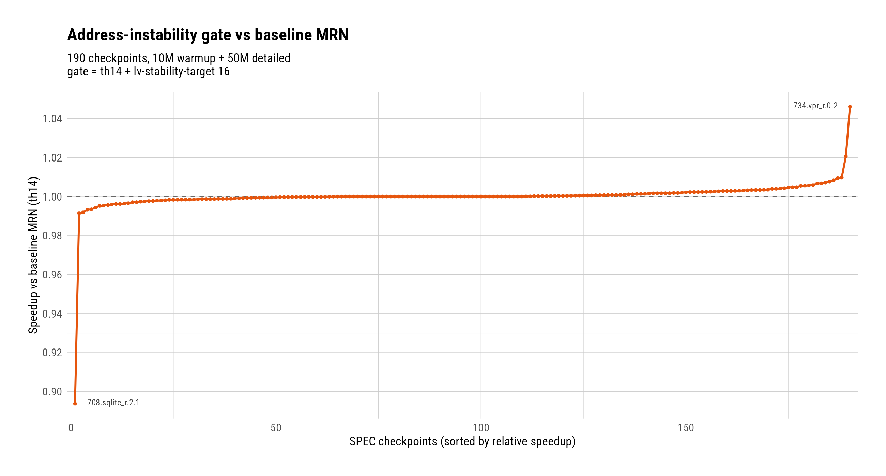
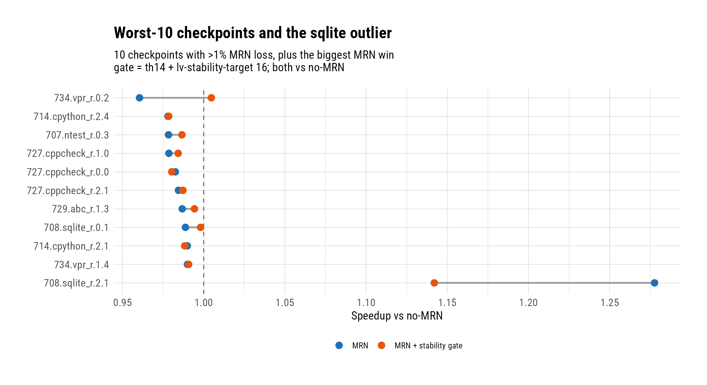

# Reducing MRN Squash Cost: Store-Write Invalidation Refuted, an Address-Instability Gate Built, and Why It Ships Disabled

**Date:** 2026-07-27 · **Branch:** `rbdev` · **Authors:** Rahul Bera and Claude Fable 5

---

## 1. Key Idea

The value-file rendezvous predictor [1, 2] closed its first full-suite
campaign at a geomean speedup of 1.0092 over 190 checkpoints, but the
residual cost is concentrated: ten checkpoints lose more than 1%, and in
every one of them the loss is flush-dominated — wrong last-value forwards
squash the pipeline (~84 flushed instructions per wrong forward on those
ten: 14.03M flushed / 167.9K wrongs)
without enough correct forwards on the critical path to pay for it. This
campaign asked whether that flush cost can be cut *without* giving up the
forwards that produce the suite-level win.

Two candidate mechanisms came from the two safety conditions of
Constable [3], transplanted from load elimination to load speculation:
(a) **store-write invalidation** — kill a self-binding when a store is
observed writing the line it forwards from (Condition-2 analog); and
(b) **address-stability gating** — require a load's address to be stable
before trusting its last-value channel (Condition-1 analog). Measurement
settled both. Invalidation is refuted outright: only 0.055% of wrong
last-value forwards ever see a prior store-write, because a self-bound cell
is refreshed with the true value at every execute — staleness in this
design comes from the *load's own address moving*, not from stores
overwriting a watched location. Address instability, by contrast, marks
80.2% of wrongs — but also 23.7% of corrects, so it cannot be an admission
filter; it works only as a *strike* signal on realized wrongs, wrapped in
hysteresis.

The resulting gate — sticky strike probation with a lifetime earning test —
compresses the loser tail (+0.77% geomean on the worst ten, the worst case
improving from −3.95% to −2.15%, one loser rescued to net-positive) at
essentially zero cost to typical winners. But it is a wash at suite level
(+0.02%), because one checkpoint, `708.sqlite_r.2.1`, gives back −10.6%:
its wrong-dense loads are *schedule-critical*, and no per-binding accuracy
statistic can see that. The gate therefore ships implemented but **off by
default**. This report records the mechanism, the two refutations, the
design iterations, and two coupling discoveries that constrain all future
work on this predictor.

## 2. Mechanism

The shipped mechanism is a consumption gate on the last-value mode of the
value-file predictor [1, 2]: a per-load-PC strike counter, advanced only by
wrong forwards whose address also changed, that disables last-value
consumption stickily and re-admits it only after sustained observed address
stability. Producer aliasing and producer-value forwarding are never gated;
shadow training continues while a binding is disabled, so confidence state
stays warm. The gate is enabled by a single parameter (`lvStabilityTarget`,
0 = off; canonical on-value 16). A store-write observation apparatus was
also built for the invalidation study and deleted once the study concluded
(commit `ac44caae2e`); it is described in §2.4 for auditability.

### 2.1 Data Structures

All state lives in the existing value-file tables
(`src/cpu/o3/mem_rename_valuefile.hh`):

- **Store/load-cache entry (`SlcEntry`), five added fields:**
  `{strikes (saturates at 2), strikeDecayCtr (8-bit), lvCorrects (32-bit,
  saturating), lvWrongs (16-bit, saturating), stableStreak (8-bit)}`.
  `lvCorrects/lvWrongs` are *lifetime* verify outcomes for the earning
  test; `stableStreak` counts consecutive same-line executes while
  disabled.
- **Value-file cell (`VfCell`), three added fields:**
  `{lastLine, lineKnown, addrChanged}` — the line the self-bound load
  resolved to last instance, and whether the current instance differs.
  Updated at address resolution; read at the verify site.
- **Rename-time cell read (`MrnVfCellRead`):** one added flag,
  `lvProbation`, set when `strikes >= 2`.

### 2.2 Verify-Site Algorithm (Strike, Decay, Earning Test)

At writeback, `trainVerify(pc, ref, correct, addrChanged)` runs after the
normal confidence update:

1. **Strike:** on `!correct && addrChanged`: `lvWrongs++`, `strikes++`
   (capped at 2), `stableStreak = 0`. A wrong at a *stable* address (value
   oscillation) takes the ordinary confidence reset but earns no strike.
2. **Earning test:** if the binding's lifetime record shows
   `lvWrongs >= 2 && lvCorrects / lvWrongs >= 256`, the second strike is
   held at 1 — a binding that pays for its rare wrongs with hundreds of
   corrects is never disabled, however clustered its wrongs arrive.
3. **Disable:** `strikes >= 2` is sticky — no decay path out. By
   construction the disable criterion is a *density* test: two
   address-instability wrongs within ~255 corrects of each other.
4. **Slow decay:** on a correct verify with `strikes == 1`, an 8-bit
   counter decays the single strike after 255 corrects. An
   address-tolerant load sheds isolated strikes; a churner cannot decay
   between wrongs.

### 2.3 Consumption Suppression and Stability Re-Enable

1. **Rename:** a bound, confident lookup with `strikes >= 2` returns
   `lvProbation`; rename suppresses *only* the last-value consumption arm
   (counted by `lvProbationSuppressed`) and the load proceeds normally,
   still shadow-training.
2. **Address resolution** (already-self-bound arm): the cell's
   `addrChanged` is recomputed against `lastLine`. While disabled,
   consecutive same-line executes advance `stableStreak`; reaching
   `lvStabilityTarget` (16) clears the strikes — re-admission requires
   *observed* stability, never elapsed time. Any line change zeroes the
   streak.

Deviation from the windowed-probation design that preceded it: there is no
time- or count-windowed re-enable. Windowed probation oscillates the
forwarding regime, and §4.7 records why that is disqualifying.

### 2.4 The Deleted Store-Write Probe (for the Record)

The invalidation study used a line-indexed load-address monitor (4096×4)
published by self-binding loads, probed by every resolved store, stamping a
per-cell `storeWriteSeq`; verify-site classifiers split last-value outcomes
by prior-store observation. It influenced no decision, produced the §4.4
refutation, and was deleted in `ac44caae2e` once the sweep settled the
gate's default. The address-stability tracking (§2.1) stays: the gate
consumes it.

### 2.5 Files Touched

- `src/cpu/o3/mem_rename_valuefile.{hh,cc}` — gate state, strike/earning/
  decay logic, stability re-enable, probation flag (+ unit tests in
  `mem_rename_valuefile.test.cc`, 17 passing).
- `src/cpu/o3/mem_rename_predictor.hh`, `mem_rename_predictor_sim.cc` —
  wrappers, `lvStabilityTarget` plumbing, stats (`lvStrikes`,
  `lvProbationSuppressed`, addr-changed/addr-same verify split).
- `src/cpu/o3/rename.cc` — probation-suppressed arm ahead of the
  last-value consumption arm.
- `src/cpu/o3/lsq_unit.cc` — address-instability input to the verify site.
- `src/cpu/o3/MemRenamePredictor.py`, `configs/garfield/arm/sim_opts.py` —
  `lvStabilityTarget` param / `--mrn-lv-stability-target` flag.

### 2.6 Commits Covered

- `8443e4ab93` — squash observability + the instability gate (all design
  iterations landed here, final form committed).
- `ac44caae2e` — deletion of the store-write probe apparatus after the
  study concluded.

## 3. Evaluation Methodology

- **Platform:** gem5 O3, Neoverse-V2-like configuration, ARM full-system
  checkpoint restore; 10M-instruction warmup + 50M detailed per
  checkpoint; first (ROI) stats dump only.
- **Workloads:** the 190-checkpoint SPEC-derived suite. The probe phase ran
  on exactly the 10 checkpoints losing >1% under baseline MRN.
- **Configurations:** baseline MRN = `--use-mrn --mrn-alias
  --mrn-conf-threshold 14` (canonical since 2026-07-26, "th14"); gate =
  th14 + `--mrn-lv-stability-target 16`. No-MRN baselines reused from the
  threshold-sweep campaign.
- **Metrics:** *speedup* = IPC / no-MRN IPC of the same checkpoint;
  *relative speedup* = IPC_gate / IPC_th14; suite numbers are geomeans over
  all 190. Per-mode accounting identity (made = correct + wrong + squashed)
  verified exact on every run read.
- **Design iterations** (all within `8443e4ab93`'s development):
  (1) *windowed probation* — suppress-N-then-retry: rejected (§4.7);
  (2) *sticky hysteresis* — strikes disable, stability re-enables: +1.09%
  on the losers but −18% risk class discovered;
  (3) *+ earning test* — the shipped form.
- **Canonical decision:** gate default **off** (`lvStabilityTarget = 0`),
  taken 2026-07-27 on the full-sweep verdict (§4.1).

## 4. Key Results

*(figure: `figs/scurve_gate_vs_th14.{png,pdf}`, numbers in
`figs/scurve_gate_vs_th14_numbers.csv`)*
*Per-checkpoint speedup of the gate relative to baseline MRN, sorted; the
tails are the whole story.*

1. **At suite level the gate is a wash — +0.02% — so it ships off by
   default.** Geomean 1.0092 (th14) → 1.0094 (gate); per-checkpoint
   relative geomean 1.00017. Distribution: 66 checkpoints up (>+0.05%),
   47 down, 77 flat; 113 → 112 beat no-MRN. The gate is pure
   risk-reallocation: it converts a diffuse loser tail into one
   concentrated regression on the suite's best checkpoint (item 3).

2. **On its target population — the ten >1% losers — the gate delivers
   +0.77% geomean and rescues the worst checkpoint to net-positive.**
   Loser geomean 0.9817 → 0.9893 vs no-MRN. `734.vpr_r.0.2`: 0.9605 →
   1.0047 (+4.61% — wrong last-value forwards 41,843 → 1,666, flushed
   instructions 2.59M → 0.17M). Suite-wide tail compression: worst case
   0.9605 → 0.9785, checkpoints below 0.99 from 10 to 7. Only two of the
   ten regress, both within noise (−0.22%, −0.16%).

   

   *(figure: `figs/worst10_gate.{png,pdf}`, numbers in
   `figs/worst10_gate_numbers.csv`)*
   *Baseline MRN vs gated MRN per loser checkpoint, plus the sqlite
   outlier that pays for it.*

3. **The cost is one schedule-critical outlier: `708.sqlite_r.2.1` gives
   back −10.6%, and no accuracy-based variant fixes it.** Its speedup
   falls 1.2776 → 1.1420 — still the suite's best MRN checkpoint, but
   half the win is gone. Suppressing its wrong-dense hot loads nearly
   triples LSQ memory-order violations (60,921 → 178,511, ×2.93), *and
   the violation count is constant across every gate variant tried* —
   windowed, sticky, earning-test. Interpretation: these loads' forwards
   hold the memory schedule together; their per-binding accuracy record
   (wrong-dense, address-unstable — indistinguishable from a churner) says
   nothing about that. **Per-binding accuracy statistics are blind to
   schedule criticality.** This is the structural gap to Constable's [3]
   elimination setting, where a suppressed load simply executes normally
   at zero cost; in a speculation setting, *not* forwarding has a price
   too.

4. **Store-write invalidation is refuted: the catchable ceiling is
   0.055%.** Across the ten probe checkpoints, 92 of 167,893 wrong
   last-value forwards had any prior store-write observed on the
   forwarding line (six of ten checkpoints: zero), against 3,877 correct
   forwards that carried the same mark — 42:1 collateral. The Condition-2
   analog [3] transfers nothing here because every execute refreshes the
   self-bound cell with the true value: the channel is never stale by
   overwrite, only by the load's own address moving. The probe apparatus
   was deleted (`ac44caae2e`).

5. **Address instability is the dominant wrong signature but a dirty
   separator — which is why the gate strikes on realized wrongs instead
   of filtering admissions.** 80.2% of wrong last-value forwards resolved
   to a different line than the previous instance, vs 23.7% of corrects.
   The separator's quality swings per checkpoint: near-perfect on
   `714.cpython_r.2.1` (wrongs 100% addr-changed, corrects 1.8%) and
   `727.cppcheck_r.2.1` (99.9% vs 3.4%); collapsed on `734.vpr_r.0.2`
   (corrects are 92.8% addr-changed — a huge legitimate address-tolerant
   class); weak on the wrong side for `708.sqlite_r.0.1` (54.5%). A
   conjunction (wrong ∧ addr-changed) with hysteresis extracts the signal;
   an admission-time address-stability filter would destroy the
   address-tolerant winners.

6. **The gate's gain is fully accounted for by removed flushes — the
   suppressed correct forwards on the losers cost nothing.** Hysteresis
   iteration, worst-10: flushed instructions 14.03M → 8.50M (39.4%
   recovered); predicted IPC gain 5.53M/500M = +1.11% vs measured +1.09%
   geomean — closure within 0.02pp. The shipped variant recovers less
   flush (35.9%, the earning test keeps high-earning churners alive) and
   measures +0.77% vs +1.01% predicted; the 0.24pp shortfall concentrates
   in `707.ntest_r.0.3` and `729.abc_r.1.3`, where earning-spared bindings
   keep flushing.

7. **Discovery: oscillating forwarding regimes poison memory-dependence
   training — mechanisms on this predictor must be regime-stable.** The
   first gate design (windowed probation: suppress N instances, then
   retry) flipped hot loads between forwarded and non-forwarded regimes.
   Each flip changes which loads issue speculatively, invalidating learned
   store sets [4]; on `734.vpr_r.2.0` this produced an −18% IPC regression
   with StoreSet conflict inflation (recorded in commit-note
   `docs/commit-notes/20260727-000006-add-squash-observability-and-instability-gate.md`;
   the run itself was overwritten by later iterations). Sticky hysteresis cured it: the same
   checkpoint reads −0.15% under the shipped gate, with `conflictingLoads`
   essentially unchanged (431,630 → 428,839).

8. **The earning test is what makes the gate safe on winners, and its
   price on the losers is visible and bounded.** Winner guard-rails under
   the shipped form: `721.gcc_r.2.0` −0.13%, `734.vpr_r.2.0` −0.15%,
   `772.marian_r.0.2` +0.13%. The cost: `729.abc_r.1.3` keeps only +0.76%
   of the +1.68% pure hysteresis gave it. `708.sqlite_r.2.1` is the one
   winner the earning test cannot protect — its critical bindings are
   genuinely wrong-dense, so they fail the earning ratio on merit.

## 5. Next Steps

1. **Latency-aware penalization (criticality-fused gating).** Scale the
   strike/penalty by the observed cost of *not* forwarding — e.g., track
   per-PC memory-order-violation or issue-delay deltas while a binding is
   probed. Ranked first because both discoveries (items 3 and 7) point at
   the same missing input, and the sqlite outlier is now a packaged
   motivating case with a clean A/B.
2. **A schedule-criticality signal per binding.** Even a coarse "this
   load's suppression raises LSQ violations" bit, sampled cheaply, would
   have kept the gate off sqlite's hot loads and made the suite verdict
   positive instead of neutral. Prerequisite for item 1's decision input.
3. **FP-destination last-value forwarding** (carried from the rendezvous
   report). Independent coverage headroom; unaffected by this campaign's
   findings.

## References

[1] G. S. Tyson and T. M. Austin, "Improving the Accuracy and Performance
of Memory Communication Through Renaming," MICRO-30, 1997.

[2] G. Reinman, B. Calder, D. Tullsen, G. Tyson, and T. Austin,
"Classifying Load and Store Instructions for Memory Renaming," Int'l
Conference on Supercomputing (ICS), 1999.

[3] R. Bera, A. Ranganathan, J. Rakshit, S. Mahto, A. V. Nori, J. Gaur,
A. Olgun, K. Kanellopoulos, M. Sadrosadati, S. Subramoney, and O. Mutlu,
"Constable: Improving Performance and Power Efficiency by Safely
Eliminating Load Instruction Execution," ISCA, 2024.

[4] G. Z. Chrysos and J. S. Emer, "Memory Dependence Prediction using
Store Sets," ISCA-25, 1998.
