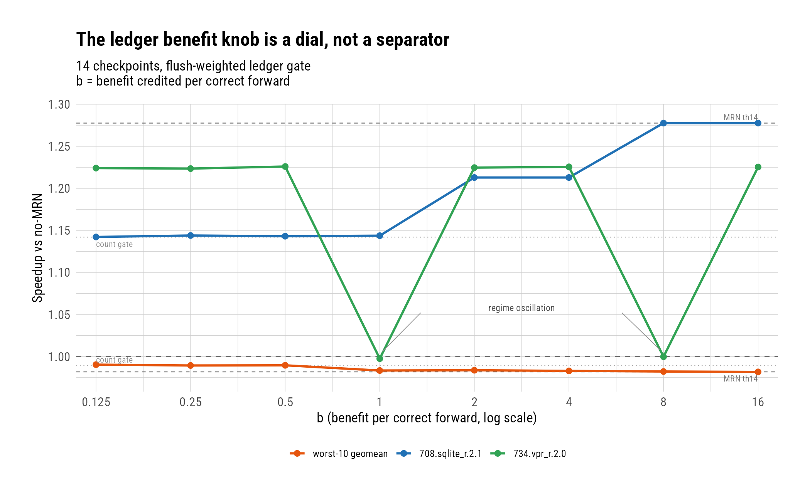
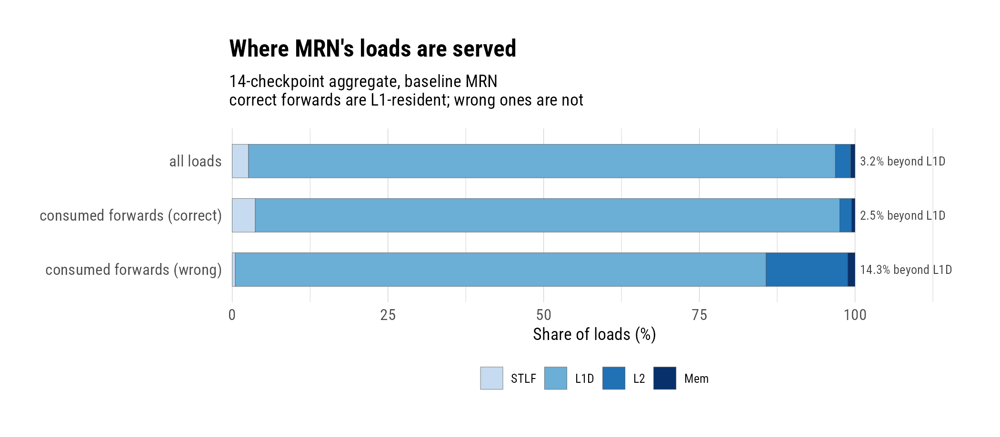

# Cost-Side Criticality for MRN: Correct Forwards Are L1-Resident, and No Flush-Weighted Penalty Can Separate Critical Bindings from Churners

**Date:** 2026-07-28 · **Branch:** `rbdev` · **Authors:** Rahul Bera and Claude Fable 5

---

## 1. Key Idea

The squash-reduction campaign left one avenue open: criticality-aware
penalization — make the predictor's penalty for a wrong forward proportional
to what the wrong actually cost, so that expensive offenders are suppressed
while cheap-but-valuable bindings survive. Before designing anything, we
tested the hypothesis that motivates skepticism about the whole direction:
MRN's bread-and-butter loads are stack loads with stable store-to-load
dependences, which should overwhelmingly hit in L1D — leaving little latency
for a criticality mechanism to redistribute.

Both halves of the campaign resolved decisively. The hypothesis is
confirmed: 97.5% of correct consumed forwards are served by store-to-load
forwarding or L1D, so the *reward* side carries no latency signal — MRN's
benefit is dataflow-height collapse (scheduling), not miss hiding. The
*cost* side, by contrast, showed a real signal: wrong forwards are 4.5×
enriched beyond L1D, and their flush cost scales 1 : 3.05 : 4.86 across
L1D/L2/memory service. We therefore built the strongest possible cost-side
policy — a ledger that charges each binding its wrongs' *measured* squash
cost and spares it while lifetime benefit covers lifetime cost — and swept
its one free parameter (b, the benefit credited per correct) over 128×.

The result is a clean negative with a measured root cause: the b axis is a
dial between the two configurations we already had (the count-based gate
and no gate), with no separating point anywhere — because the populations
that must be separated are *inverted* on the cost-benefit plane.
sqlite.2.1's schedule-critical bindings earn only ~7–13 corrects per cheap
(53-instruction) wrong, while vpr.0.2's worthless churners earn up to ~450
corrects per equally cheap wrong. No uniform benefit credit can order them;
the value of the critical bindings is extrinsic to any per-binding account.
Cost-side criticality is closed, the MRN configuration is finalized
(threshold-14 baseline, all gates off), and the separating signal — if one
exists — must come from the benefit side. This report records the
attribution mechanism, the ledger, the sweep, and two hazards found on the
way.

## 2. Mechanism

Two pieces of permanent observability and one experimental policy, all in
the value-file predictor [1, 2].

### 2.1 Memory-Service-Level Attribution

Every completed load is attributed to the level that served its data,
riding the classic caches' existing `Request::depth` counter (incremented
by each cache on a miss): depth 0 = L1D hit, 1 = L2 hit, ≥ 2 = memory.
Loads fully satisfied by store-to-load forwarding never reach the caches
and are stamped **STLF** at the LSQ forward site. The level is stored on
the DynInst at writeback and read at the MRN verify sites. Stats:
`loadLevelAll` (every load — the reference distribution) and
`vfConsumedLevelCorrect/Wrong` (consumed forwards by verify outcome).
Known caveat, documented in the stat description: an MSHR-coalesced
secondary miss keeps only its own descent depth, so a secondary behind an
in-flight memory fetch counts as L2 — the L2/memory split slightly
understates memory; the L1-versus-beyond split is exact.

### 2.2 Flush-Cost Accounting

`vfWrongFlushedByLevel` accumulates, per serving level, the squash cost
already computed at each wrong-verify site (`getCurrentInstSeq() −
load.seqNum`). By construction its total equals `squashedInsts` — an
identity that held exactly on every run read for this report. Dividing by
`vfConsumedLevelWrong` gives the average flush per wrong by level.

### 2.3 The Flush-Weighted Ledger Gate

The stability gate's sparing decision (its earning test) becomes a
cost-benefit ledger behind `lvFlushLedger` (default **off**;
`--mrn-lv-flush-ledger`):

- **State:** one field added to the store/load-cache entry —
  `lvFlushCost`, a 32-bit saturating accumulator, charged at the strike
  site (wrong ∧ address-changed) with the wrong's measured flush clamped
  to 511 per instance (one full-ROB outlier cannot bankrupt a young
  binding).
- **Decision:** count mode spares a binding while
  `lvCorrects / lvWrongs ≥ 256`; ledger mode spares it while
  `lvCorrects × b ≥ lvFlushCost`, with b =
  `--mrn-lv-benefit-per-correct`, the design's one free parameter, in
  flushed-instruction equivalents. The `lvWrongs ≥ 2` guard, the
  two-strike sticky disable, slow decay, probation, and the
  stability-streak re-enable are all unchanged from the count-based
  gate; alias and producer-value modes remain ungated.
- **Observability:** `lvEarningSpared` counts second strikes held by the
  earning/ledger test.

### 2.4 Files Touched

- `src/cpu/o3/dyn_inst.hh` — `MemSrcLevel` enum + per-inst level field.
- `src/cpu/o3/lsq_unit.cc` — STLF stamp; level derivation at writeback;
  level and flush-cost notes at the verify sites; measured squash passed
  into training.
- `src/cpu/o3/mem_rename_valuefile.{hh,cc}` — ledger config/state/logic
  (+ 3 unit tests in `mem_rename_valuefile.test.cc`; 20 total passing).
- `src/cpu/o3/mem_rename_predictor.hh`, `mem_rename_predictor_sim.cc` —
  wrappers and the seven new stats.
- `src/cpu/o3/MemRenamePredictor.py`, `configs/garfield/arm/sim_opts.py`
  — `lvFlushLedger`, `lvBenefitPerCorrect` params and CLI flags.

### 2.5 Commits Covered

- `9f037a0d44` — service-level attribution + flush-cost stats.
- `4fed00c084` — the flush-weighted ledger gate (negative result recorded
  in its commit-note).
- Context: `8443e4ab93` (the count-based stability gate this modifies),
  documented in the squash-reduction report.

## 3. Evaluation Methodology

- **Platform:** gem5 O3, Neoverse-V2-like, ARM FS checkpoint restore,
  10M warmup + 50M detailed, first (ROI) stats dump only.
- **Checkpoint set:** the 14 diagnostic checkpoints — the ten losing >1%
  under baseline MRN, plus four winner sentinels (708.sqlite_r.2.1,
  734.vpr_r.2.0, 721.gcc_r.2.0, 772.marian_r.0.2).
- **Probe:** baseline MRN (`th14`) + attribution stats, all 14.
- **Sweep:** th14 + stability gate 16 + ledger, b ∈ {0.125, 0.25, 0.5, 1,
  2, 4, 8, 16} — 112 runs. References: th14 and the count-based gate
  (`gate16`), both from prior sweeps on disk.
- **Metrics:** speedup = IPC / no-MRN IPC per checkpoint; loser-10
  geomean over the ten losers. Accounting identities
  (level sums = per-mode outcome sums; flush-by-level total =
  `squashedInsts`) verified exactly on all runs.
- **Verification:** stats-only changes proven bit-identical with
  everything off (3,483 and 3,566 shared stats, zero differ); 20/20 unit
  tests.
- **Disclosed wrinkle:** `slcAllocate` does not clear gate/ledger fields,
  so a recycled SLC entry inherits the evicted PC's history. Pre-existing
  (affects the count gate too); left unfixed so the committed code is
  exactly what was measured; both sides of every A/B share the behavior.

## 4. Key Results

*(figure: `figs/bsweep_dial.{png,pdf}`, numbers in
`figs/bsweep_dial_numbers.csv`)*
*The ledger's benefit knob interpolates between the count-gate and no-gate
endpoints; the two dips are the b = 1 and b = 8 oscillation landmines.*

1. **Correct MRN forwards are L1-resident — the reward side of
   criticality is empty, confirming the stack-load hypothesis.** 97.5% of
   consumed-correct forwards are served by STLF (3.70%) or L1D (93.84%),
   *more* L1-resident than the general load population (96.8%). The
   suite's biggest MRN win, sqlite.2.1 (+27.8%), has 95.3% of its correct
   forwards L1D-served: the benefit is collapse of the load→use dataflow
   height and memory-schedule stabilization, not latency hiding — the
   speculation-side counterpart of Constable's [3] observation that
   likely-stable loads are cheap to satisfy but expensive to schedule.
   772.marian_r.0.2 is the purest form: 47.4% of its correct forwards are
   STLF pairs. Any policy that *rewards* forwarding by covered latency has
   nothing to work with.

   

   *(figure: `figs/consumed_levels.{png,pdf}`, numbers in
   `figs/consumed_levels_numbers.csv`)*
   *Correct forwards mirror the all-loads distribution; wrong forwards do
   not.*

2. **The flush-weighted ledger fails: its b axis is a dial between the
   two known endpoints, with no separating point in a 128× range.** At
   b ≤ 0.5 it reproduces the count-based gate (loser-10 geomean 0.9893–
   0.9904 vs gate's 0.9893; sqlite.2.1 stuck at 1.142, the −10.6% cliff).
   At b ≥ 8 it restores sqlite.2.1 exactly (1.2776 = ungated) while
   un-rescuing every loser (geomean 0.9817–0.9822 = ungated). Between
   them, monotone trade — sqlite recovers in steps (1.213 at b = 2–4) as
   the losers give back their rescue. `lvEarningSpared` on sqlite.2.1
   climbs 71 → 3,232 and `lvStrikes` falls 1,319 → 0 across the range:
   the ledger did exactly what it was designed to do, and what it was
   designed to do cannot win.

3. **The root cause is measured, not conjectured: the two populations
   are inverted on the cost-benefit plane.** Full sparing of sqlite.2.1
   requires b = 8, i.e. its schedule-critical bindings earn only
   corrects/wrong ≳ 6.6 (partial recovery at b = 4 brackets them in
   ~7–13) against cheap, 52.8-instruction wrongs. Rescuing vpr.0.2
   requires *disabling* bindings that earn up to ~450 corrects per
   equally cheap (61.6-instruction) wrong. The valuable bindings are
   *more* wrong-dense than the worthless ones at the same per-wrong cost,
   so no uniform benefit credit — no b — can order them. This is the
   deepest finding of the campaign: **per-binding cost accounting is
   information-poor; the benefit that distinguishes a critical binding is
   extrinsic** (its effect on the memory schedule), invisible to any
   ledger built from that binding's own outcomes.

4. **The cost-side signal itself was real and consistent — the premise
   held; the policy still failed.** Wrong forwards are 4.5× enriched
   beyond L1D (14.28% vs 3.16% of all loads), and flush cost scales with
   serving level: 61.5 / 187.3 / 298.7 instructions per L1D/L2/memory-
   served wrong (1 : 3.05 : 4.86), consistent across all 14 checkpoints
   (L2 range 158–258). The enrichment concentrates exactly where
   expected: vpr.2.0's wrongs 74.1% L2-served, abc.1.3's 40.4%.

5. **New hazard: ledger-margin oscillation.** At exactly b = 1 and b = 8
   — and at no neighboring value — vpr.2.0 collapses −18.6% with
   `conflictingLoads` inflating 6.5× (426K → 2.76M), the StoreSet [4]
   poisoning signature from the squash campaign's windowed-probation
   iteration. A binding whose ledger balance hovers near zero flips
   between spared and disabled on successive wrongs, oscillating the
   forwarding regime and invalidating memory-dependence training. The
   ledger's balance moves by ±cost on every wrong, so it *creates* knife
   edges the slow-moving count ratio does not; the landmines' positions
   are binding-specific and unpredictable, so even a locally good b would
   not be robust. Corollary reaffirmed: mechanisms coupled to this
   predictor must be regime-stable by construction.

6. **A congestion effect validates measuring cost directly even though
   the policy failed: vpr.2.0's L1D-served wrongs flush 196 instructions
   each — 3.2× the 14-checkpoint L1D mean.** At IPC 0.81 with a full ROB,
   even a fast verify discards a large window. Level buckets would have
   systematically underweighted this checkpoint; the realized flush count
   captures phase congestion for free. If cost-weighting is ever revived
   (e.g. the expensive-only-debt variant, Next Steps), it should weight
   by measured flush, not by level.

7. **The MRN configuration is finalized: `--use-mrn --mrn-alias
   --mrn-conf-threshold 14`, both gates off (defaults).** Suite geomean
   1.0092 over 190 checkpoints, spread 0.9605–1.2776, 113/190 above 1.0.
   The stability gate (`--mrn-lv-stability-target`) and the ledger
   (`--mrn-lv-flush-ledger`, `--mrn-lv-benefit-per-correct`) remain as
   documented research knobs. This closes the MRN optimization chapter
   opened by the value-file rendezvous report.

## 5. Next Steps

1. **Benefit-side criticality — a new project, not a configuration
   knob.** The separating signal must measure a binding's *scheduling*
   value (e.g. per-binding feedback that its suppression raises memory-
   order violations, or issue-slack sampling at consumers). Result 3 is
   the impossibility proof that motivates it; the sqlite.2.1 ↔ vpr.0.2
   pair is the packaged A/B. Natural hand-off point to Garfield's core
   agenda, where load criticality is already the organizing question.
2. **Expensive-only debt, if the loser tail ever matters enough.** Teeth
   only above a per-wrong cost threshold (~150: L2/memory-verified
   wrongs) is the one cost-side variant that cannot recreate the sqlite
   cliff (its wrongs are 99.8% L1D-served — immune by construction), at
   the price of forfeiting vpr.0.2. Estimated +0.2–0.4% on the losers,
   ~0 suite; an afternoon to pin down if wanted.
3. **Hygiene before any future gate work: clear gate/ledger fields in
   `slcAllocate`.** Recycled SLC entries currently inherit the evicted
   PC's strike/earning history (§3). Unmeasured but wrong; fix it first
   so future A/Bs start clean.

## References

[1] G. S. Tyson and T. M. Austin, "Improving the Accuracy and Performance
of Memory Communication Through Renaming," MICRO-30, 1997.

[2] G. Reinman, B. Calder, D. Tullsen, G. Tyson, and T. Austin,
"Classifying Load and Store Instructions for Memory Renaming," Int'l
Conference on Supercomputing (ICS), 1999.

[3] R. Bera, A. Ranganathan, J. Rakshit, S. Mahto, A. V. Nori, J. Gaur,
A. Olgun, K. Kanellopoulos, M. Sadrosadati, S. Subramoney, and O. Mutlu,
"Constable: Improving Performance and Power Efficiency by Safely
Eliminating Load Instruction Execution," ISCA, 2024.

[4] G. Z. Chrysos and J. S. Emer, "Memory Dependence Prediction using
Store Sets," ISCA-25, 1998.
