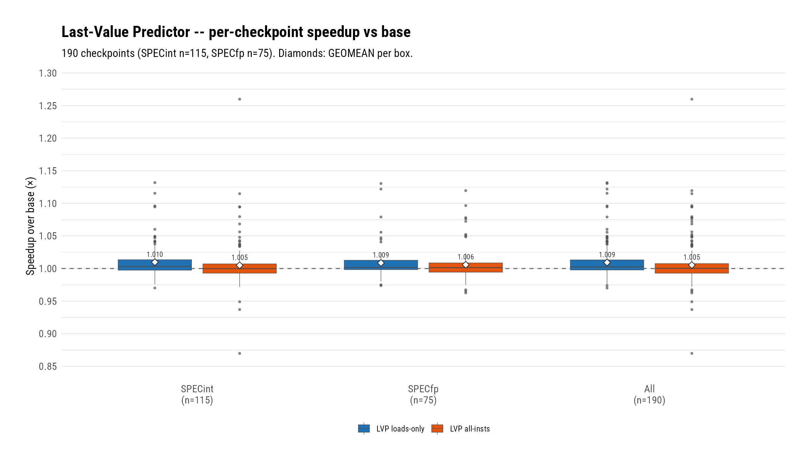
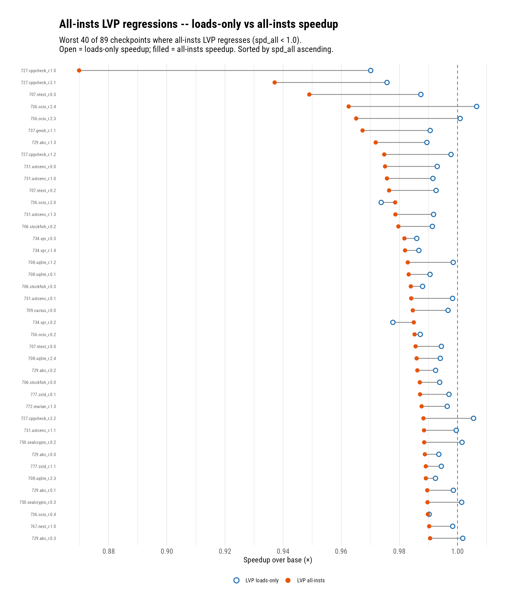
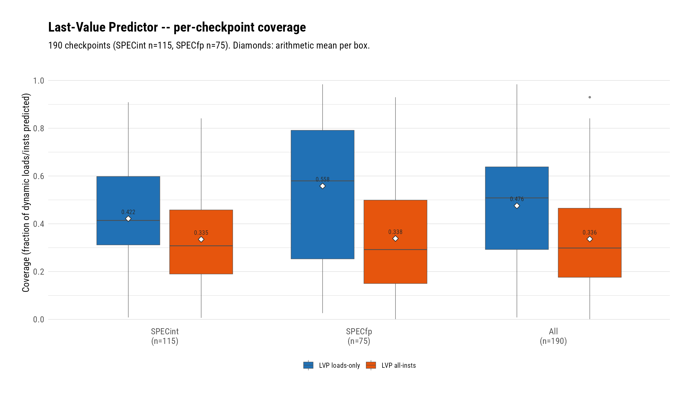
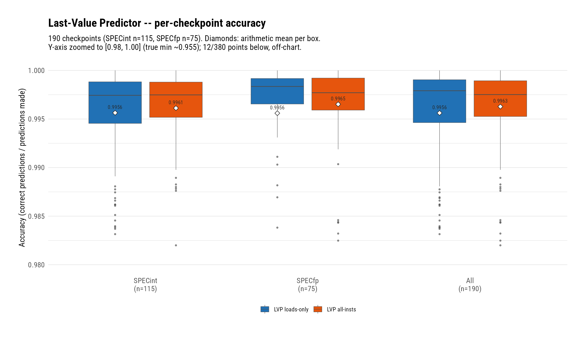

# The VP Framework and Its First Predictor: Loads-Only Last-Value Prediction Matches MRN's Finalized Gain

**Date:** 2026-08-03 · **Branch:** `vp` · **Authors:** Rahul Bera and Claude (Fable 5)

---

## 1. Key Idea

Value Prediction is the third stage of Garfield's speculative
data-dependency-breaking sequence (branches → memory renaming → value
prediction). The MRN chapter closed with a finalized geomean of 1.0092
over 190 SPEC26 checkpoints and two hard lessons: for L1-resident
values the benefit is *scheduling*, not latency, and wrong data-flow
predictions cost ~60–300 flushed instructions each, so confidence must
start conservative. This chapter asks the natural next question: how
much of that gain does classic PC-indexed value prediction capture,
without any of MRN's store→load rendezvous machinery?

The answer, measured here, is *all of it*: a Last-Value Predictor
(LVP) [1, 2] in its loads-only scope, at an untuned conservative
configuration, lands at geomean **1.0093** — statistically identical
to MRN's finalized 1.0092 — from a single PC-indexed table, no store
tracking, no alias analysis, and no StoreSet coupling. Widening scope
to all integer-destination instructions *loses* ground at the same
configuration (1.0053), and the loser anatomy shows why: in both
scopes the losing checkpoints match the winners on accuracy and on
per-flush cost, and are separated only by *mispredict volume* — a
population that per-instruction-class confidence (the EVES idea [4])
and history-correlated prediction (VTAGE [3]) directly target.

The chapter's infrastructure deliverable is as important as the
result: an algorithm-agnostic VP framework in the O3 model (predict at
rename, train at writeback, verify with MRN's proven inclusive squash)
into which subsequent predictors drop as one SimObject each. LVP's job
was to prove that framework end-to-end; this report is the record of
both. Building it also surfaced one genuinely subtle pipeline bug —
the *doomed-window* shadow-training hole — described in §2.3 because
any future verify-site change must respect it.

## 2. Mechanism

The framework follows the prefetcher-style pattern: an abstract
`BaseValuePredictor` SimObject owns the pipeline contract, eligibility
filtering, and the base stat surface; each algorithm is a derived
SimObject wrapping a params-free, GTest-covered core table. LVP
implements last-value prediction per Lipasti et al. [1, 2] with
deliberate deviations listed in §2.3. MRN's algorithm code is
untouched throughout; the shared squash-attribution plumbing was
generalized (`MrnSquashReason` → `SquashReason`) with zero behavior
change.

### 2.1 Data Structures

- **LvpTable (the VPT)** — 4096 entries × 4-way, LRU, full tags (no
  false-aliasing artifacts in a research simulator). Entry:
  `{valid, tag, lastValue (64b), conf, lastUse}`. Confidence is a
  4-bit saturating counter; a value match increments it, a mismatch
  resets it to zero (default) or applies a decrement clamped below the
  threshold (knob). Prediction requires `conf >= confThreshold`
  (default 15 — near-saturated, per the MRN flush-economics lesson).
- **Lookup key** — instruction PC XOR (micro-PC << 48): AArch64
  cracked macro-ops (e.g. `ldp`) share a PC, and without the micro-PC
  fold their two destination values ping-pong one entry so confidence
  never builds.
- **DynInst additions** — `VpPredicted`/`VpResolved` flags plus the
  64-bit predicted value; `VpResolved` enforces exactly-once outcome
  accounting across verify and the overlapping squash walks.
- **Doomed-window mark** — one `InstSeqNum` per thread in IEW (§2.3).

### 2.2 Pipeline Algorithm

1. **Rename (consume).** After `renameDestRegs`, behind the
   MRN → VP → execute priority ladder (`!inst->isMrned()`): the base
   class filters eligibility — single scalar integer, non-fixed-mapping
   destination; not serializing/barrier/non-speculative/atomic/
   store-conditional; loads-only unless the scope knob widens it — and
   on a confident hit writes the predicted value into the renamed
   destination physreg and marks the scoreboard ready (MRN's
   value-forward mechanism, reused verbatim). Consumers wake
   immediately; the instruction still executes normally.
2. **Verify.** Loads at LSQ writeback, non-loads (all-insts scope
   only) at IEW writeback: compare the architected result against the
   prediction. Wrong → inclusive squash via
   `IEW::squashDueToValueMispredict` (the instruction itself refetches
   from its own PC — MRN's exact recovery semantics, so MRN's measured
   flush economics carry over). No squash livelock by construction:
   a wrong verify always leaves confidence below threshold (reset
   mode; clamped decrement; `confThreshold == 0` is a construction-
   time fatal), and the doomed-window guard (§2.3) makes the
   corrective train the last table write before the refetch re-renames.
3. **Train.** Every in-scope, not-already-squashed instruction trains
   at writeback — predicted or not, and including MRN-claimed loads —
   so tables stay warm regardless of consumption.
4. **Squashed-before-verify.** The ROB and CPU squash walks count
   predictions killed before verification, under the `VpResolved`
   exactly-once discipline mirrored from MRN's accounting.

### 2.3 The Doomed-Window Guard, and Deviations From Prior Art

Adversarial review runs at a hostile configuration (confidence
threshold 0) exposed a livelock whose root cause is reachable at
*every* threshold: between a squash being signaled and its victims
being flag-marked (~2 cycles), not-yet-marked doomed instructions
still passed the verify/train gates and trained wrong-path values. At
threshold 0 this closed a squash/refetch loop (the refetch predicted
the *next* iteration's value forever — caught by the fork's ROB-head
watchdog); at production thresholds it silently inflated
`predictionsCorrect` (in the reproducer, *every* "correct" verify was
a doomed instruction) and polluted table state. The fix is a
per-thread pending-squash low-water mark in IEW, set by every
IEW-initiated squash and cleared when the commit-side squash
acknowledgment covers it; it gates only the VP verify/train sites, so
MRN's published accounting is untouched. A `fatal_if` rejects a value
predictor combined with a configured `squashWidth`, whose multi-cycle
ROB walks would reopen the window.

Deviations from the cited prior art: prediction happens at **rename**
(not fetch [3] or dispatch [1]) because the framework consumes
predictions through renamed physregs; recovery is inclusive
squash-from-the-instruction (MRN's mechanism) rather than the
classification-table refetch of [1]; confidence is a 4-bit
near-saturated counter rather than the 2-bit classification counter of
[1] — chosen from MRN's measured squash costs, not swept; the table is
4-way LRU with full tags rather than direct-mapped.

### 2.4 Files Touched

- `src/cpu/o3/vp/lvp_table.{hh,cc}`, `vp_key.hh` — params-free VPT
  core + key folding (15 GTests in `lvp_table.test.cc`).
- `src/cpu/o3/vp/base.{hh,cc}` — `BaseValuePredictor`: API,
  eligibility/scope, base stats (pinned counting sites).
- `src/cpu/o3/vp/last_value.{hh,cc}` — `LastValueVP` SimObject +
  table stats (incl. the eviction thrash signal).
- `src/cpu/o3/vp/ValuePredictor.py`, `SConscript` — SimObject/params/
  build registration; `DebugFlag('ValuePred')`.
- `src/cpu/o3/squash_reason.hh` (renamed from `mrn_squash_reason.hh`),
  `iew.{hh,cc}`, `comm.hh`, `commit.cc`, `rob.{hh,cc}` — generalized
  squash plumbing; `squashInclusive` extraction;
  `squashDueToValueMispredict`; the doomed-window mark.
- `src/cpu/o3/rename.{hh,cc}`, `lsq_unit.cc`, `cpu.{hh,cc}`,
  `dyn_inst.hh`, `BaseO3CPU.py` — consume site, verify/train sites,
  squash-walk accounting, DynInst state, `valuePred` param.
- `configs/garfield/arm/sim_opts.py` — `--use-vp TYPE` + `--vp-*`
  knobs, factory, attach, banner.
- gem5-infra `workloads/microbenchmarks/src/{vpchase,vpalu}/` — the
  Stage-III kernels (commit `68ceab3` there).

### 2.5 Commits Covered

- `155b5c6358` — design spec.
- `9f8c5c8166` — implementation plan.
- `a96a493f7e` — params-free LVP core + GTests.
- `b925f8d3f5` — squash-reason generalization (zero behavior change).
- `ab298ac9b7` — VP SimObject framework + LVP (inert until wired).
- `eebb020b2d` — pipeline integration + CLI + doomed-window fix.
- `420d6d3ba8` — final-review closure (squashWidth fatal, eviction
  stat, spec conformance).

## 3. Evaluation Methodology

- **Simulator:** gem5 (this fork), Neoverse V2 O3 model
  (`configs/garfield/arm/neoverse_v2.py`: TAGE_SC_L_64KB branch
  predictor, decoupled front-end + FDP, L1D Stride+SMS, L2 BOP), FS
  checkpoint restores via `fs_run.py`.
- **Workloads:** 190 SPEC26 SimPoint checkpoints (26 `_r` benchmarks:
  115 SPECint-rate, 75 SPECfp-rate checkpoints; suite classification
  per the official SPEC CPU2026 documentation), 10M warmup + 50M
  detailed instructions; ROI = first stats dump; IPC = the
  `start.core.ipc` line.
- **Configurations:** `base` (no VP, no MRN), `lvp`
  (`--use-vp lvp`: loads-only), `lvp_all` (`--use-vp lvp
  --vp-all-insts`). All at the design defaults: 4096×4 VPT, 4-bit
  confidence, threshold 15, reset-on-wrong. MRN off in all three.
  All three sides ran fresh on the same binary (`420d6d3ba8`).
- **Metric definitions:** *speedup* = checkpoint IPC / its `base`
  IPC, aggregated by geomean. *Coverage* = `predictionsCorrect /
  (eligibleLoads + eligibleNonLoads)` — the denominator counts every
  in-scope instruction reaching the train site, aggregated by
  arithmetic mean. *Accuracy* = `predictionsCorrect /
  (predictionsCorrect + predictionsWrong)` — the verified-only
  denominator (never correct/made: ~11% of made predictions are
  squashed before verifying and would deflate the ratio). *Pipeline
  flushes* = `predictionsWrong` (each wrong triggers exactly one
  inclusive-squash request). *Instructions per flush* =
  `squashedInsts / predictionsWrong`, counted at verify time (§6 of
  the stat description records the same-cycle over-attribution
  caveat).
- **Stage-III gate (2026-08-02):** purpose-built microbenchmarks —
  `vpchase` (pointer self-loop: serial load chain, invariant loaded
  value) and `vpalu` (serial 8-deep multiply chain, runtime-opaque
  multiplier) — run SE before any checkpoint was spent.

## 4. Key Results

*(figure: `figs/lvp_suite_speedup.{png,pdf}`, numbers in
`figs/lvp_suite_speedup_numbers.csv`)*
*Per-checkpoint speedup spread by suite group; diamonds mark geomeans.*

1. **Loads-only LVP matches the entire finalized MRN chapter: geomean
   1.0093 over 190 checkpoints (MRN: 1.0092), 119/190 above 1.0,
   spread 0.9701–1.1318.** One PC-indexed table replicates the gain
   that took MRN a value file, store/load caches, address rendezvous,
   and a squash-reduction campaign. The mechanism-level echo of the
   MRN closure finding: for L1-resident values the benefit is breaking
   the *scheduling* dependence, and a stable last value does that as
   well as a store→load binding. The gain is also suite-neutral —
   SPECint 1.0097 (n=115), SPECfp 1.0086 (n=75) — see the lead figure.

2. **Widening scope to all integer-destination instructions is a net
   loss at the same configuration: geomean 1.0053 vs base, 0.9961 vs
   loads-only (45 checkpoints better, 123 worse).** It is a
   high-variance dial, not a uniform tax: `708.sqlite_r.2.1` stacks to
   **1.2598** total (+11.3% over its loads-only 1.1318) and the
   `767.nest_r` family gains +4–7.5%, while `772.marian_r.0.2` gives
   back its entire loads-only win (0.8877 relative), `736.ocio_r.2.1`
   drops 11.6%, and `727.cppcheck_r.1.0` compounds to 0.8698 — the
   campaign's only >5% loser. Non-loads are 72% of the eligible
   population but far less value-stable: coverage drops from 47.6% to
   33.6% (mean) while total wrongs nearly triple (1.84M → 5.31M).

   

   *(figure: `figs/lvp_allinsts_losers_dumbbell.{png,pdf}`, numbers in
   `figs/lvp_allinsts_losers_dumbbell_numbers.csv`)*
   *Each row one all-insts loser (worst 40 of 89 plotted; all 89 in
   the CSV); open point = loads-only speedup, filled = all-insts.*

3. **Loser anatomy, both scopes: mispredict *volume* is the only
   discriminator — accuracy and per-flush cost do not separate losers
   from winners.** Loads-only losers (71 of 190) vs winners: accuracy
   99.26% vs 99.74%, instructions-per-flush 67.9 vs 69.2 — nearly
   identical; what differs is flush count (the significant band
   averages 22.2k wrongs per 50M window, 2.4× everyone else). The
   loads-only tail is remarkably benign: **zero** checkpoints lose
   more than 3%.

   | scope | loss band | #ckpt | geomean | coverage | accuracy | flushes/ckpt | insts/flush |
   |---|---|---|---|---|---|---|---|
   | loads-only | ≥5% | 0 | — | — | — | — | — |
   | loads-only | 3–5% | 0 | — | — | — | — | — |
   | loads-only | 1–3% | 12 | 0.9814 | 0.523 | 0.9942 | 22,240 | 63.7 |
   | loads-only | <1% | 59 | 0.9961 | 0.331 | 0.9923 | 7,936 | 70.3 |
   | loads-only | all losers | 71 | 0.9936 | 0.363 | 0.9926 | 10,354 | 67.9 |
   | loads-only | winners (ref) | 119 | 1.0188 | 0.542 | 0.9974 | 9,315 | 69.2 |
   | all-insts | ≥5% | 3 | 0.9180 | 0.295 | 0.9818 | 189,905 | 32.7 |
   | all-insts | 3–5% | 3 | 0.9650 | 0.497 | 0.9923 | 72,390 | 32.4 |
   | all-insts | 1–3% | 32 | 0.9839 | 0.303 | 0.9937 | 38,124 | 54.1 |
   | all-insts | <1% | 51 | 0.9961 | 0.256 | 0.9963 | 20,336 | 48.8 |
   | all-insts | all losers | 89 | 0.9879 | 0.282 | 0.9947 | 34,202 | 46.7 |
   | all-insts | winners (ref) | 101 | 1.0209 | 0.384 | 0.9976 | 22,439 | 48.7 |

   The all-insts ≥5% band makes the volume story vivid: 190k flushes
   per checkpoint at only 32.7 instructions each — individually the
   *cheapest* flushes in the campaign (ALU wrongs verify early in
   their in-flight window), but ≈6.2M flushed instructions is 12% of
   the measurement window. Cheap × enormous = the tail.

4. **The 89 all-insts losers were, collectively, break-even under
   loads-only (geomean 0.9986 → 0.9879), and 32 of them flipped from
   outright loads-only winners.** Losing checkpoints are not "bad VP
   targets" — they are checkpoints whose *non-load* value streams are
   semi-stable, repeating long enough to reach threshold 15 and then
   changing. This is precisely the population per-instruction-class
   confidence (EVES's p=1 vs p=1/128 increment rates [4]) is designed
   to suppress, and where history-correlated prediction (VTAGE [3])
   should convert mispredicts into hits rather than suppressing them.

5. **Coverage and accuracy distributions (companion figures):
   loads-only coverage averages 47.6% (winners 54.2%, losers 36.3%)
   and accuracy 99.56% with a 0.986 floor.** Threshold 15 does its
   job: at ~68 instructions per wrong (loads) the measured flush tax
   stays below the scheduling gain for 63% of checkpoints. Coverage —
   not accuracy — is what winners have and losers lack in the
   loads-only scope.

   
   

   *(figures: `figs/lvp_suite_coverage.{png,pdf}`,
   `figs/lvp_suite_accuracy.{png,pdf}` + their numbers CSVs)*

6. **A pure scheduling-side-effect loser class exists:**
   `736.ocio_r.2.0` loses 2.6% with **12** wrong predictions and
   accuracy 1.0000. Correct forwards change issue timing (consumers
   wake at rename instead of at load writeback), which can perturb
   downstream resource scheduling unfavorably — the inverse of the
   MRN lesson that the benefit is scheduling. Flush-side tuning cannot
   recover this class.

7. **Stage-III gate: the framework is provably correct end-to-end.**
   `vpchase` 5.99× and `vpalu` 6.05× speedup at accuracy 1.0, with
   coverage at LVP's theoretical maximum (vpalu's unpredicted 11.1%
   are the loop-counter PCs whose values change every iteration).
   Hostile-config validation survived 440k mispredict-squash
   recoveries on `branchsort` with bit-identical program output, and
   `vpalu` under forced mispredicts matches its closed-form checksum
   exactly — architectural state is preserved through the inclusive
   squash path at volume.

8. **Measurement-integrity note (the doomed-window bug, §2.3): before
   the fix, every "correct" verify in the hostile reproducer came from
   an already-doomed instruction.** Any accuracy or coverage number
   produced by a verify-site change that bypasses the guard should be
   treated as suspect; the guard's preconditions are now
   construction-time fatals precisely so this failure cannot recur
   silently.

## 5. Next Steps

1. **VTAGE** — the design is settled (HPCA'14 configuration [3],
   VP-private speculative branch history, commit-time training via a
   per-predictor knob, FPC confidence): targets the volume-loser
   population of Result 3 by predicting *changing* values that
   correlate with branch history, and lifts coverage where last-value
   fundamentally cannot.
2. **Per-instruction-class confidence rates (EVES [4])** — a small
   FPC-vector extension once VTAGE lands; directly aimed at the
   all-insts tail (Result 4): cheap ALU ops must earn prediction ~128×
   more slowly than miss-bound loads.
3. **Merge `vp` → `rbdev`** — the branch passed a three-lens
   whole-branch review with all findings closed; loads-only LVP at
   the defaults is a safe, characterized reference point.
4. **Volume-loser concentration analysis** — whether the 12 (loads)
   and 38 (all-insts) significant losers' wrongs concentrate in few
   PCs (per-PC suppression viable) or spread (only class-level gating
   helps); one probe sweep with per-PC wrong counting.
5. **MRN + VP composition** — the priority ladder is coded and
   smoke-tested but never evaluated; now that both mechanisms have
   matched standalone gains, their overlap (or additivity) is the
   obvious question — and `sqlite_r.2.1`'s 1.2598 under all-insts LVP
   vs 1.2776 under MRN suggests they chase the same dominant
   opportunity.

## References

[1] M. H. Lipasti and J. P. Shen, "Exceeding the Dataflow Limit via
Value Prediction," Proceedings of the 29th Annual IEEE/ACM
International Symposium on Microarchitecture (MICRO-29), 1996.

[2] M. H. Lipasti, C. B. Wilkerson, and J. P. Shen, "Value Locality
and Load Value Prediction," Proceedings of the 7th International
Conference on Architectural Support for Programming Languages and
Operating Systems (ASPLOS-VII), 1996.

[3] A. Perais and A. Seznec, "Practical Data Value Speculation for
Future High-end Processors," 2014 IEEE 20th International Symposium on
High Performance Computer Architecture (HPCA-20), 2014.

[4] A. Seznec, "Exploring value prediction with the EVES predictor,"
First Championship Value Prediction (CVP-1), 2018.
