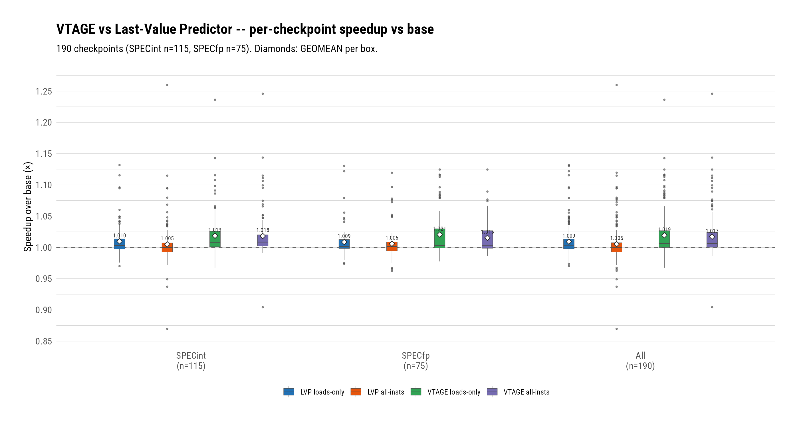
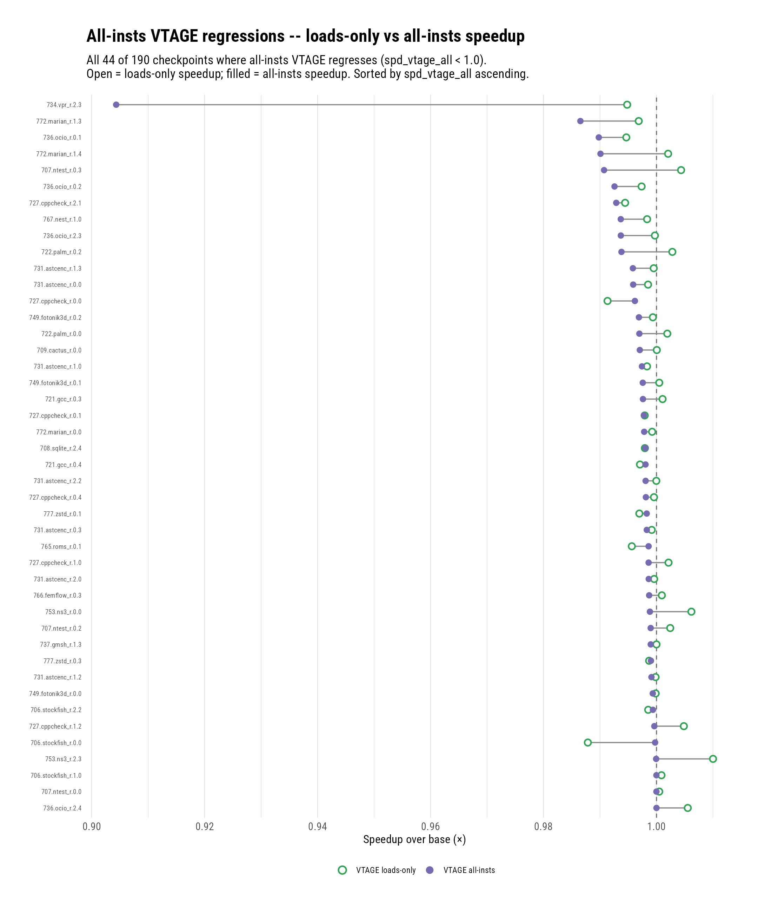
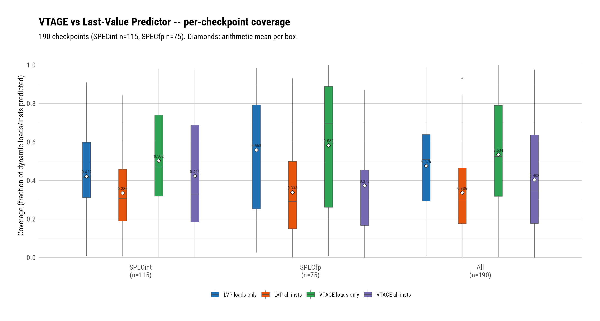
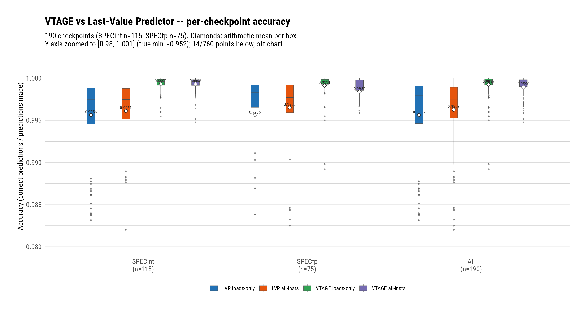

# VTAGE Doubles the Value-Prediction Gain at a Sixth of the Mispredicts — and Repairs the All-Instructions Scope

**Date:** 2026-08-04 · **Branch:** `vp` · **Authors:** Rahul Bera and Claude (Fable 5)

---

## 1. Key Idea

The LVP campaign (previous entry in this log) established two facts:
loads-only last-value prediction already matches MRN's finalized gain
(geomean 1.0093 vs 1.0092 over 190 SPEC26 checkpoints), and its losers
— in both scopes — are separated from winners *only by mispredict
volume*: values that repeat long enough to reach confidence, then
change. Widening LVP to all instructions was a net loss (1.0053)
precisely because the non-load population is full of such
semi-stable values.

VTAGE [1] attacks that population from both sides. History-correlated
indexing (PC hashed with geometric slices of global branch/path
history, ITTAGE-style) turns values that change *with control flow*
from confidence-churn into hits; Forward Probabilistic Counters (FPC)
make a 3-bit confidence counter behave like a ~7-bit one, throttling
exactly the almost-stable patterns that generated LVP's wrong volume.
Both promises are confirmed here at full scale: VTAGE reaches geomean
**1.0194** loads-only — double the LVP/MRN gain — while cutting total
wrong predictions **6.3×** (1.84M → 292k) at 99.92% accuracy, and the
all-instructions scope flips from LVP's net loss to **1.0171**,
beating `lvp_all` on 150 of 190 checkpoints. The loser signature
*inverts* in the process: under VTAGE, losing checkpoints flush *less*
than winning ones — the flush tax is essentially eliminated, and what
remains of the loss tail is dominated by a scheduling-side-effect
class that no confidence mechanism can address.

The report covers the VTAGE implementation on the VP framework (six
commits), the framework extensions it required (speculative history
subsystem, commit-time training, the verify-site corrective reset that
carries the no-livelock invariant), the `vphist` microbenchmark that
proves the history-correlation mechanism in isolation, and the
five-way Stage-IV evaluation.

## 2. Mechanism

VTAGE follows Perais & Seznec's HPCA-20 design [1] (structure and
update rules first published in the RR-8155 report [2]; index/tag
folding per the TAGE lineage [4], mirrored from gem5's own TAGE
implementation). Deliberate deviations are listed in §2.3.

### 2.1 Data Structures

- **VT0 (base)** — tagless, PC-indexed, 8192 entries:
  `{val (64b), c (3b)}` — structurally an LVP.
- **VT1..VT6 (tagged)** — 1024 entries each:
  `{val (64b), c (3b), tag (12+rank b), u (1b)}`, history lengths
  L = {2, 4, 8, 16, 32, 64}. Longest matching component provides;
  prediction is delivered only at `c >= confThreshold` (default 7 =
  saturation).
- **Lookup key** — the µop-distinguished PC
  `(((pc XOR (upc << 48)) >> 2) << 2) | (upc & 3)`: the µop residue
  is *concatenated* into the low bits the PC shift vacated. Two prior
  formulations failed review: the high-bit fold alone never reaches
  the ≤18-bit hashed tags/indices (cracked µops collide in every
  component), and XOR-ing the raw µop number into PC-delta bits
  merely moves the alias to neighboring instructions at a
  power-of-two PC distance. Folded on demand with per-component
  history slices — exact and stateless because the maximum history
  (64) fits one snapshot register.
- **FPC** — each forward confidence transition fires with probability
  `v = {1, 1/16, 1/16, 1/16, 1/16, 1/32, 1/32}` (the squash-recovery
  vector of [1]); the reset on a wrong is never probabilistic.
  Randomness from gem5's seeded generator — runs are deterministic.
- **Speculative history (the only speculative state)** — a per-thread
  `{ghr (64b), path (16b)}` pair in the VP framework: updated at the
  fetch-side per-instruction choke point, snapshotted onto every
  DynInst at creation, restored on every fetch redirect via a
  dedicated VP-only commit→fetch carrier
  (`{valid, snapshot, kind}`) following a per-initiator table —
  branch mispredicts advance the snapshot by the *resolved* outcome,
  inclusive VP/memory-order squashes restore the refetched
  instruction's snapshot exactly, traps restore the squash point,
  squash-after advances past the committed instruction's own
  contribution, decode corrections use the decode-resolved outcome.
  Residual unrestorable cases (empty-ROB thread-context squashes) are
  counted (`historyRestores::missed` — single digits per 60M-inst
  run in practice).
- **Provider token** — an opaque 64-bit per-instruction token stamped
  on *every* predict() lookup (biased rank; all-zeros is never
  legal), letting commit-time training and the verify-site corrective
  reset update exactly the providing entry, tag-checked against
  in-flight reallocation.

### 2.2 Pipeline Algorithm

1. **Predict (rename).** Fold indices/tags from the instruction's
   fetch-time snapshot; longest tag match provides (VT0 otherwise);
   stamp the token unconditionally; deliver the value only at
   saturation. Consumption is the framework's physreg-write +
   scoreboard-ready mechanism, unchanged.
2. **Verify (writeback) — the corrective reset.** A delivered-wrong
   prediction squashes inclusively and never retires, so commit-only
   training would never correct its entry and the refetched instance
   would re-predict the same wrong value forever. The verify-wrong
   arm therefore performs an immediate, tag-checked `c = 0, u = 0`
   through the token — and nothing else (no value write, no
   allocation: a delivered-wrong instruction can itself be
   wrong-path, and a bare reset is the only table write that can
   never create a prediction). Same train-before-squash ordering the
   LVP campaign proved; measured: corrective resets match
   `predictionsWrong` one-for-one in the hostile smoke run.
3. **Train (commit, provider-only).** Retiring in-scope instructions
   train their predict-time provider through the token (stale token
   or MRN-claimed loads fall back to a counted recompute): correct →
   FPC-gated `c++`, `u = 1`; wrong → value overwrite if `c == 0`
   else `c = 0`, `u = 0`; allocation on wrong outcomes into a
   random not-useful longer-history component, with `u`-aging when
   none qualifies. Wrong-path never trains (squashed instructions
   never retire).

### 2.3 Deviations From the Papers

Prediction at rename (not fetch [1]) using the fetch-time history
snapshot — equivalent index inputs; validation at writeback with
inclusive squash (not commit-time validation [1]) — strictly earlier
recovery, making the squash-class FPC vector conservative; the
value-overwrite and mispredict-driven allocation defer one dynamic
instance on delivered-wrongs (the refetched instance's committed
train performs them with committed-path state); the concatenated µop
key (the papers' x86 µop XOR recipe [1 §7.2] is unsafe for our hashed
low bits, above); full-width value storage, LRU-free direct-indexed
banks, and fold-on-demand exactly as sized in [1].

### 2.4 Files Touched

- `src/cpu/o3/vp/vtage_tables.{hh,cc}`, `vtage_tables.test.cc` —
  params-free core (7 banks, folds, FPC with injectable RNG,
  allocation, corrective reset); 29 GTests including
  defect-replay-proven alias pins and golden-token drift detectors.
- `src/cpu/o3/vp/vtage.{hh,cc}` — the `VtageVP` SimObject:
  per-component provider stats, FPC fired/suppressed, token-stale
  recomputes.
- `src/cpu/o3/vp/vp_history.hh`, `vp_types.hh`, `base.{hh,cc}` —
  framework generalization: lookup context, predict-result token
  channel, `trainsAtCommit`/`usesHistory` knobs, the history
  subsystem, restore stats.
- `src/cpu/o3/{fetch,bac}.{cc,hh}`, `comm.hh`, `commit.{hh,cc}`,
  `iew.{hh,cc}`, `lsq_unit.cc`, `dyn_inst.hh` — history
  stamp/update/restore plumbing (the carrier), commit-time train
  hook, verify-site corrective reset, ctor-cached gating (LVP and
  baseline behavior proven unchanged at every step).
- `src/cpu/o3/vp/ValuePredictor.py`, `SConscript`,
  `configs/garfield/arm/sim_opts.py` — params, registration,
  `--use-vp vtage`.
- gem5-infra `workloads/microbenchmarks/src/vphist/` — the
  history-correlation microbenchmark (commit `fc9536d` there).

### 2.5 Commits Covered

- `a36364ad8d` — design spec (three-lens adversarial review; the
  commit-train/writeback-verify reconciliation is its load-bearing
  outcome).
- `77f3311f17` — implementation plan (tree-scout grounded).
- `89a9537ffe` — params-free core tables.
- `975f97d7be` — framework generalization (LVP bit-identity proven).
- `45b885793f` — pipeline wiring (history subsystem + carrier).
- `89a9692edc` — VtageVP SimObject + ten-run smoke matrix.
- `e2379e0b32` — final-review closure (neighbor-alias key fix, merge
  hygiene).

## 3. Evaluation Methodology

- **Simulator/platform/workloads:** identical to the LVP report —
  Neoverse V2 O3 model, 190 SPEC26 checkpoints (115 SPECint / 75
  SPECfp per official SPEC CPU2026 classification), 10M warmup + 50M
  detailed, first-dump ROI, `start.core.ipc`.
- **Configurations:** the LVP campaign's `base`/`lvp`/`lvp_all` runs
  are reused unchanged; new `vtage` (`--use-vp vtage`, loads-only)
  and `vtage_all` (`+ --vp-all-insts`), HPCA'14 defaults (8K base +
  6×1K tagged, histories 2–64, 3-bit confidence at saturation, the
  squash-recovery FPC vector). All five configurations' binaries are
  the same commit (`e2379e0b32`); LVP numbers are bit-reproducible on
  it (gated at every framework-touching task).
- **Metric definitions:** as the LVP report (speedup vs `base` by
  geomean; coverage = correct/eligible by arithmetic mean; accuracy =
  correct/(correct+wrong), the verified-only denominator; flushes =
  `predictionsWrong`; instructions-per-flush =
  `squashedInsts/predictionsWrong`). **One declared denominator
  caveat:** VTAGE trains at commit, so its eligible population counts
  *retiring* instructions, while LVP's counts not-yet-squashed
  writebacks — VTAGE coverage is systematically measured against a
  slightly smaller, committed-only denominator.
- **Stage-III gate (2026-08-03):** `vphist` — a single-PC load whose
  value is fully determined by a period-7 branch-direction pattern —
  plus the LVP campaign's `vpchase`/`vpalu` rerun under VTAGE.

## 4. Key Results

*(figure: `figs/vtage_suite_speedup.{png,pdf}`, numbers in
`figs/vtage_suite_speedup_numbers.csv`; per-checkpoint data for every
table below in `figs/vtage_report_per_checkpoint.csv`)*
*Four boxes per suite group: LVP and VTAGE in both scopes; diamonds
mark geomeans.*

1. **VTAGE doubles the chapter's gain: geomean 1.0194 loads-only
   (142/190 above 1.0) vs LVP's 1.0093 — with 6.3× fewer wrong
   predictions (292k vs 1.84M) at 99.92% accuracy.** Per-checkpoint
   it beats LVP 125 to 38 (geomean ratio 1.0100). Both paper
   mechanisms contribute measurably: coverage rises 47.6% → 53.4%
   (history-correlated hits LVP cannot express) while wrong volume
   collapses (FPC throttling the almost-stable patterns). Best case
   `714.cpython_r.2.2` at **1.2362** (93.5% coverage, accuracy
   1.0000) — the campaign record; the `748.flightdm_r` family gains
   11–12% on history-correlated fp values LVP could not touch.

2. **The all-instructions scope is repaired: vtage_all reaches 1.0171
   (146/190) where lvp_all lost ground at 1.0053 — beating lvp_all on
   150 of 190 checkpoints (geomean ratio 1.0117).** This is the
   direct answer to the LVP report's loser analysis: the volume-loser
   population (semi-stable non-load values) is exactly what FPC
   suppresses — vtage_all's 924k wrongs vs lvp_all's 5.31M. Suite
   split: SPECint is now scope-insensitive (1.0186 loads-only vs
   1.0183 all-insts) while SPECfp still prefers loads-only (1.0206 vs
   1.0153).

3. **The loser signature inverts under VTAGE: flush volume no longer
   discriminates — coverage does.** Under LVP, losers were the
   high-wrong checkpoints; under VTAGE, losers flush *less* than
   winners (loads-only: 1,217 vs 1,639 flushes per checkpoint) and
   match them on accuracy (99.88% vs 99.94%) — what separates them is
   coverage (42.2% vs 57.1%). The flush tax is essentially
   eliminated, and the loss tail is thin: **zero checkpoints lose
   ≥5%, one loses 3–5%, and only 5 lose more than 1%** (loads-only).

   | scope | loss band | #ckpt | geomean | coverage | accuracy | flushes/ckpt | insts/flush |
   |---|---|---|---|---|---|---|---|
   | vtage | ≥5% | 0 | — | — | — | — | — |
   | vtage | 3–5% | 1 | 0.9674 | 0.445 | 0.9986 | 4,506 | 87.2 |
   | vtage | 1–3% | 4 | 0.9833 | 0.580 | 0.9996 | 1,146 | 69.8 |
   | vtage | <1% | 42 | 0.9979 | 0.406 | 0.9988 | 1,145 | 75.5 |
   | vtage | all losers | 47 | 0.9960 | 0.422 | 0.9988 | 1,217 | 76.0 |
   | vtage | winners (ref) | 143 | 1.0272 | 0.571 | 0.9994 | 1,639 | 70.2 |
   | vtage_all | ≥5% | 1 | 0.9043 | 0.085 | 0.9999 | 269 | 42.5 |
   | vtage_all | 3–5% | 0 | — | — | — | — | — |
   | vtage_all | 1–3% | 2 | 0.9882 | 0.301 | 0.9983 | 3,616 | 69.9 |
   | vtage_all | <1% | 41 | 0.9973 | 0.292 | 0.9976 | 4,407 | 49.8 |
   | vtage_all | all losers | 44 | 0.9947 | 0.287 | 0.9977 | 4,277 | 50.6 |
   | vtage_all | winners (ref) | 146 | 1.0240 | 0.438 | 0.9993 | 5,038 | 54.0 |

4. **VTAGE fixes the majority of LVP's losers: 37 of 71 became
   winners, and the group as a whole swung from 0.9936 to 1.0011 —
   net positive.** Losing under last-value prediction does not mean
   losing under value prediction; it means the value stream needed a
   history index.

5. **The all-insts loser transition is mild — with one loud
   exception that isolates the scheduling-side-effect class.** The 44
   vtage_all losers were essentially break-even at loads-only (0.9995
   → 0.9947; 16 were loads-scope winners) — cf. the dumbbell figure.
   The exception: `734.vpr_r.2.3` at **0.9043** with 8.5% coverage,
   **269 wrongs** (42.5 insts/flush ⇒ ~11k flushed insts in a 50M
   window ≈ 0.02%), accuracy 99.99% — a 9.6% loss with *no*
   meaningful flush tax, on a checkpoint where vtage loads-only
   (0.9948) and even lvp_all (0.9970) are fine. This is the LVP
   report's `ocio_r.2.0` class at scale: ~800k *correct* forwards
   perturbing wakeup/issue scheduling. Confidence mechanisms cannot
   address it; it is a scheduling problem.

   

   *(figure: `figs/vtage_allinsts_losers_dumbbell.{png,pdf}` + numbers
   CSV; all 44 losers plotted)*

6. **The history-correlation mechanism is proven in isolation:
   `vphist` gives VTAGE 99.66% coverage at accuracy 1.0000 with
   tagged components providing, where LVP's coverage is exactly 0.**
   The bench: one load PC whose value is fully determined by a
   period-7 branch pattern — last-value has nothing to hold on to,
   history indexing resolves it perfectly. VT0 meanwhile reproduces
   LVP on the LVP campaign's benches (vpchase 3.99 IPC, vpalu 2.07 —
   at reference levels). Bench-design lesson recorded: vphist's
   loaded value deliberately feeds no loop-carried dependence, so it
   proves *prediction*, not speedup — IPC is identical across
   configs because the OOO core hides an L1 hit that nothing waits
   on.

   
   

   *(figures: `figs/vtage_suite_coverage.{png,pdf}`,
   `figs/vtage_suite_accuracy.{png,pdf}` + numbers CSVs)*

7. **Worst-case anatomy (`734.vpr_r.2.0`, 0.9674 loads-only): the
   loss is mostly not flush tax either.** 4,506 wrongs at 87.2
   insts/flush — the campaign's deepest flushes (long-history
   providers dominate: 3.24M of its provider lookups hit VT6) — total
   393k flushed insts, 0.8% of the window, against a 3.3% loss. The
   remainder is the same correct-forward scheduling perturbation as
   Result 5, plus long-history churn. The restore machinery itself is
   healthy here: 7 missed restores out of ~22.5k.

8. **Measurement-integrity record: five defects were caught by review
   *before* any checkpoint ran, each of which would have silently
   corrupted this report's numbers.** (a) The commit-train /
   writeback-verify composition would have left delivered-wrong
   predictions permanently untrained — a deterministic same-PC
   livelock — resolved by the verify-site corrective reset (§2.2);
   (b, c) two generations of µop-key aliasing (inert high-bit fold,
   then a neighbor-PC alias from the XOR repair) — the final
   concatenated key is pinned by a defect-replay regression test;
   (d) the inclusive-squash history restore was silently skipped in
   its dominant case (victim at ROB head); (e) the unstamped
   ifetch-fault noop zeroed the entire history on every FS page-fault
   trap. All five are regression-covered (29 GTests, the ten-run
   smoke matrix, `historyRestores::missed` observability).

## 5. Next Steps

1. **Merge `vp` → `rbdev`** — two whole-branch reviews passed, all
   findings closed, and both campaigns' published numbers are
   reproducible on the final binary.
2. **History-length study: the geometric series looks truncated at
   64.** The suite-wide provider-correct distribution
   (`figs/vtage_provider_distribution.csv`) is flat from L=8 outward,
   and the longest component (L=64) still earns **11.0%** of all
   correct predictions with the highest tagged lookup share (20.7%) —
   in TAGE methodology, a longest-table share that has not collapsed
   is the signature of a series cut short of the correlation horizon.
   VP series will never reach branch prediction's thousands of bits
   (a VTAGE entry is ~80 bits vs TAGE's ~15, and FPC saturation needs
   on the order of 130 correct observations of the exact value under
   the exact context, so long-history warmth economics degrade far
   faster) — but 64 does not look like the crossover. Our
   snapshot-and-fold-on-demand design makes the experiment unusually
   cheap (widening the snapshot to 128 bits touches no restore
   machinery, unlike classic incremental-fold implementations).
   Planned sweep: 6 components re-spaced to 128 (area-neutral), 7
   components to 128 (+one 1K bank), and a re-spacing-within-64
   control to separate reach from spacing.
3. **EVES per-class confidence rates [3]** — the designed follow-up
   knob: per-instruction-class FPC vectors (LLC-miss loads at p=1 vs
   single-cycle ALU at p=1/128) target what remains of the vtage_all
   gap to loads-only, and SPECfp's scope sensitivity (Result 2).
4. **The scheduling-side-effect class** — now the dominant residual
   loss mechanism (Results 5 and 7) and out of reach of any
   confidence policy: `734.vpr_r.2.3` is the isolated specimen
   (9.6% loss, 269 wrongs). The MRN chapter closed on "the benefit is
   scheduling"; this chapter adds *the residual harm is scheduling
   too* — a study of when correct early wakeups hurt is the natural
   next investigation.
5. **MRN + VP composition** — both mechanisms now have matched or
   better standalone gains and a coded, smoke-tested priority ladder;
   whether they compose or overlap is unmeasured.
6. **Threshold/geometry sweeps** — everything ran at untuned HPCA'14
   defaults; the FPC vector, confidence threshold, and table sizing
   are all params awaiting a sweep.

## References

[1] A. Perais and A. Seznec, "Practical Data Value Speculation for
Future High-end Processors," 2014 IEEE 20th International Symposium
on High Performance Computer Architecture (HPCA-20), 2014.

[2] A. Perais and A. Seznec, "Revisiting Value Prediction," INRIA
Research Report RR-8155, November 2012.

[3] A. Seznec, "Exploring value prediction with the EVES predictor,"
First Championship Value Prediction (CVP-1), 2018.

[4] A. Seznec and P. Michaud, "A case for (partially) TAgged
GEometric history length branch prediction," Journal of
Instruction-Level Parallelism (JILP), vol. 8, 2006.
