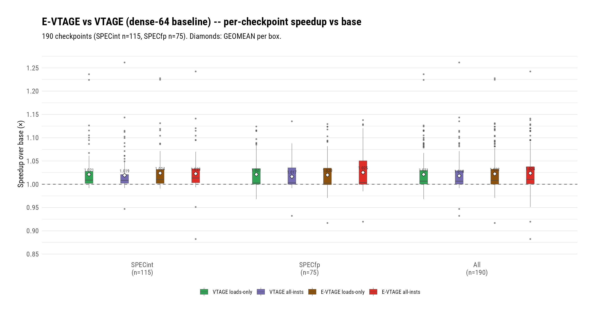
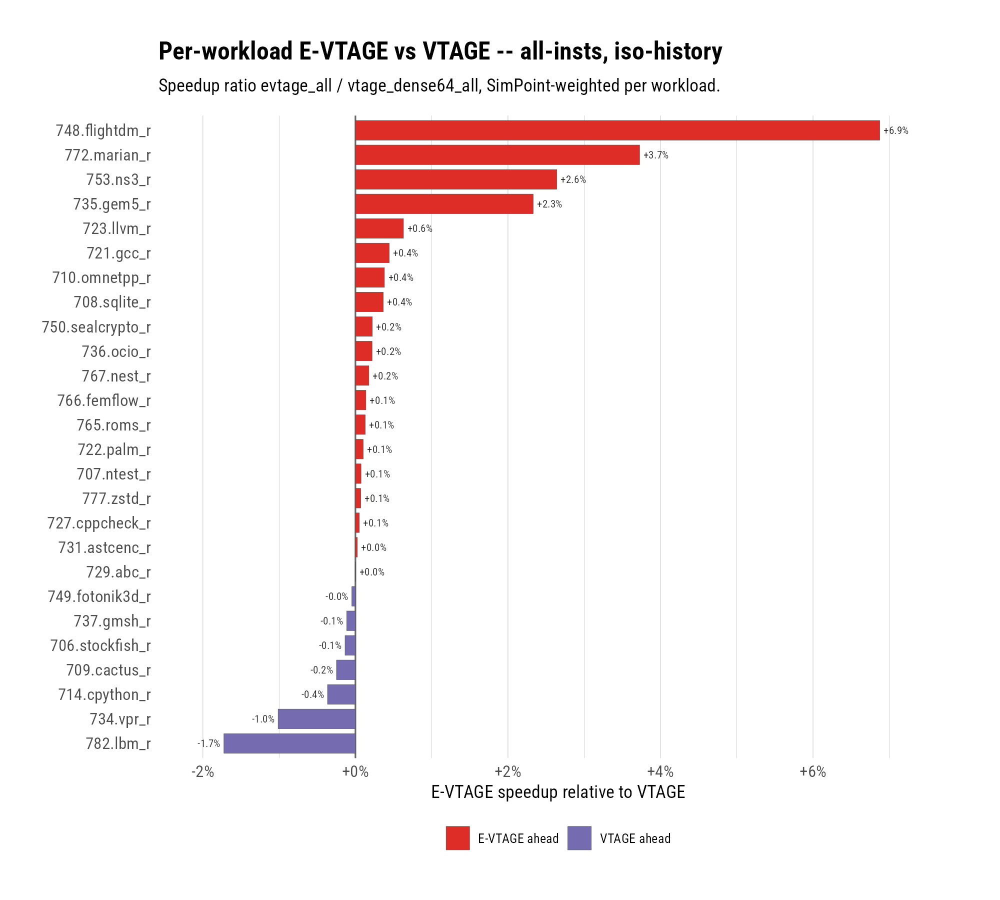
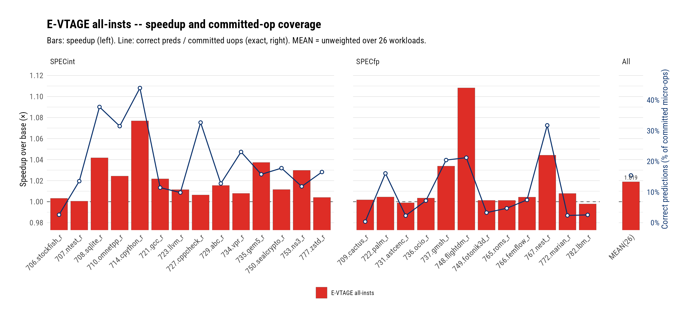
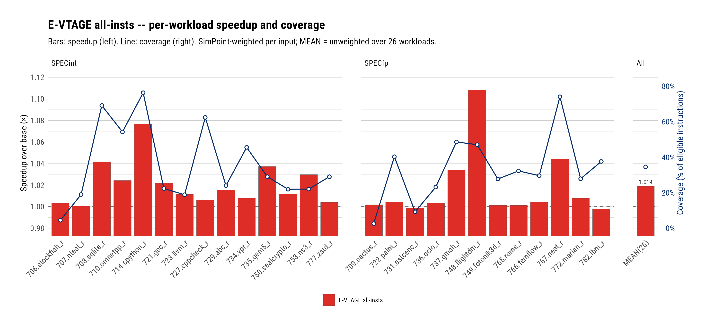

# E-VTAGE: CVP's Per-Class Confidence Policy Survives the Pipeline — +0.55% Over the Best VTAGE Where It Claims to Act, With 28% Fewer Wrongs From Less Coverage

**Date:** 2026-08-05 · **Branch:** `vp` · **Authors:** Rahul Bera and Claude (Fable 5)

---

## 1. Key Idea

VTAGE's confidence machinery is *uniform*: every instruction class
earns delivery through the same Forward Probabilistic Counter (FPC)
vector, and every allocation costs the same. But the value-prediction
population is not uniform. A load that missed to DRAM repeats its
value for very different reasons than a single-cycle ALU op; a value
of 0 or 1 is a far safer bet than a 64-bit pointer; an instruction
fed by two live integer operands is less likely to be
history-predictable than one fed by none. EVES [3] — the winner of
the first Championship Value Prediction — encoded exactly this
observation as *per-class probabilistic rates*: confidence-promotion
probabilities and allocation probabilities computed per prediction
from the instruction's class, its memory-serve level, its operand
count, and the magnitude of its value. In Seznec's own ablation the
policy is most of the predictor: EVES's score drops 4.202 → 3.710
without it.

The catch, and the reason this report exists: that result was earned
on CVP's *trace-driven, infinite-window* simulator, where a wrong
prediction costs a fixed penalty and a correct one is pure profit.
Whether the policy's aggression/deferral profile survives a real
out-of-order pipeline — with inclusive squashes, speculative history,
partial-window refetches, and wrong-path pollution — was untested.
This campaign transplants the policy *alone*: E-VTAGE is our VTAGE
with the EVES confidence/allocation engine grafted in at **identical
geometry and identical history series**, so the A/B isolates the
policy from every other variable. The comparison baseline throughout
is the strongest VTAGE this log has produced: the dense-64 series
`{2,4,6,11,20,36,64}` (1.0212 loads-only / 1.0181 all-insts; see the
VTAGE report's history-series result).

The verdict: the policy transfers. E-VTAGE all-insts reaches geomean
**1.0238** over 190 SPEC26 checkpoints — the best number of the
value-prediction chapter — beating the iso-history VTAGE control by
**+0.55%** with **28% fewer wrong predictions**, and making all-insts
the winning scope for the first time. The mechanism is visible in the
coverage ledger: E-VTAGE predicts *more* loads (the safe class) and
*fewer* non-loads (the dangerous one) — placement, not volume. This
report covers the E-VTAGE implementation (three commits over the
frozen VTAGE substrate), the commit-site "optimized instruction"
counter it motivated, and the full two-scope evaluation against the
dense-64 VTAGE baseline. The MRN-composition experiments run on the
same counters are deliberately excluded — they get their own report.

## 2. Mechanism

E-VTAGE keeps VTAGE's structure — a tagless base table plus
geometrically-historied tagged components, speculative VP-private
history, verify-at-writeback with corrective reset, train-at-commit —
and replaces the *decision layer*: how confidence is earned, when a
prediction is delivered, how wrongs are punished, and where
allocations land. All rates are verbatim transcriptions from the
CVP-1 EVES source (the K32 probability idiom), not re-derivations;
deviations are enumerated in §2.3.

### 2.1 Data Structures

- **Base** — 8192 entries, now **2-way skewed-associative with
  tags** (EVES's base is two independently-hashed ways):
  `{val (64b), c (3b), u (2b), tag}`. Rank 0/1 = the two base ways.
- **VT1..VT7 (tagged)** — 1024 entries each, histories
  L = {2, 4, 6, 11, 20, 36, 64} (the dense-64 series, matching the
  baseline): `{val (64b), c (3b), tag (12+rank b), u (2b)}`.
- **Classifier context** (`VpClassifierInfo`, built by the framework
  at the verify/train sites): `{instClass (Load/Store/Alu/Undef +
  indirect-call override), memSrcLevel (stlf/l1d/l2/mem/unknown),
  nbOperand (integer non-flag sources), value}`.
- **Per-entry policy bits**: `punishApplied` and `medConfPending`
  bridge the verify-site punish and the commit-site train of the same
  dynamic prediction (the pipeline splits what CVP does at one site).

### 2.2 The Per-Class Policy

1. **Confidence promotion (train-correct).** Confidence increments
   with probability `1/2^(7-E)` where the exponent
   `E = LOWVAL + NOTLLCMISS + 2·FASTINST + NOTL2MISS + NOTL1MISS +
   ((≠load) ∨ NOTL1MISS)`, `LOWVAL = (|2v+1| < 2^16) + (v = 0)` —
   small values, fast instructions, and cache-hitting loads confirm
   fast; a DRAM-miss pointer load crawls. A base-way provider gets
   the doubled-rate arm (both base ways count as rank ≤ 1).
2. **Punish (verify-wrong, tag-checked).** At saturation
   (`c = 7`): `{c ← 5, u ← 1}` — a one-notch demotion that keeps the
   entry warm but closes the delivery gate (threshold 7). Below
   saturation: `{c ← 0, u ← 0}`. The wrong train also
   *unconditionally overwrites* the stored value.
3. **Allocation (train-wrong / train-miss).** Gated by an outer
   operand test for alu/store/undef classes (≥2 operands: 1/16, else
   1/64) and an inner exponent
   `E' = ((≠load) ∨ NOTL1MISS)·LOWVAL + NOTLLCMISS + NOTL2MISS +
   NOTL1MISS + 2·FASTINST` applied as a `(2<<E')−1` mask; MedConf
   classes take a deterministic body. New entries land at
   `providerRank + 1` with a 1/8 promotion bump; with no provider,
   7/8 of allocations scan the two base ways (zero-operand ALU seeds
   confidence straight to 7 — a constant is a constant) and 1/8 land
   in VT1.
4. **Useful bits and recycling.** `u` is 2-bit; exploration credit
   (UPDATEU) accrues on non-delivered corrects, deterministic `u++`
   at `c = 7`; a global TICK (`allocation-failures − 5·allocations`,
   pass at 1024) mass-decays `u` when the predictor thrashes.

### 2.3 Deviations From the CVP-1 Source

- **Policy essence only**: EVES's value compression and bank
  interleaving are not ported (orthogonal capacity tricks; our A/B is
  iso-geometry with the VTAGE baseline by design).
- **Split sites**: CVP punishes and trains at one place; our punish
  runs at verify (pre-squash, tag-checked) and training at commit,
  bridged by the `punishApplied`/`medConfPending` entry bits.
- **Eligible direct calls classify as Alu**: gem5 marks flag-less
  branches `IntAluOp`, so an AArch64 `BL`'s link-register write takes
  the zero-operand seed-to-7 arm and instantly predicts its constant
  return address. CVP dispatches these to deterministic-false gates.
  Declared, deliberate, and symmetric across the A/B (plain VTAGE
  predicts them too).
- **Burst guard present but constructor-guarded off**: EVES's
  LastMispVT window needs a renamed-instruction count the pipeline
  does not feed yet; a nonzero window would silently suppress all
  predictions, so construction `fatal`s on it.
- **E-Stride is absent**: this is EVES Stage 1. The stride component
  (and with it the full EVES) is the designed next stage.

### 2.4 Files Touched

- `src/cpu/o3/vp/evtage_tables.{hh,cc,test.cc}` — the params-free
  policy core (54 GTests; every formula arm pinned).
- `src/cpu/o3/vp/evtage.{hh,cc}` — the `EVtageVP` SimObject: config
  marshalling, single RNG stream, 17-stat surface, burst-guard
  construction guard.
- `src/cpu/o3/vp/vp_types.hh`, `base.{hh,cc}` — `VpClassifierInfo` /
  `VpInstClass` built at the framework's train/verify paths;
  rename-count hook declared for the burst guard.
- `src/cpu/o3/vp/last_value.{hh,cc}`, `vtage.{hh,cc}` — mechanical
  signature migration (bit-identity proven for both).
- `src/cpu/o3/commit.{hh,cc}` — `committedVpPredicted` /
  `committedMrned` commit-site counters (§3, metric 4).
- `src/mem/cache/prefetch/fdp.cc` — the base-branch infinite-loop
  fix the campaign's one hang led to (result 9).
- `configs/garfield/arm/sim_opts.py` — `--use-vp evtage`,
  `--evtage-{hist-lengths,conf-threshold,burst-guard}`.

### 2.5 Commits Covered

- `3ecc2e713f` — design spec (28 review findings closed against the
  CVP source; the K32 formulas are its load-bearing content).
- `ad9e2482ea` — implementation plan.
- `e90069289a` — params-free core tables (the review round here
  caught a provider-rank landing off-by-one that had silently killed
  VT1 — fixtures had pinned the bug, mutation testing re-proved the
  fix).
- `cb541d486a` — classifier context + `EVtageVP` SimObject + CLI
  (dual bit-identity gate: LVP smoke and VTAGE FS-checkpoint runs
  value-identical on the final binary).
- `355485c074` — FDP infinite-loop fix (result 9).
- `42c2800c68` — commit-site optimized-instruction counters.

## 3. Evaluation Methodology

- **Simulator/platform/workloads:** as the LVP/VTAGE reports —
  Neoverse V2 O3 model, 190 SPEC26 checkpoints (115 SPECint / 75
  SPECfp), 10M warmup + 50M detailed instructions, first-dump ROI,
  `start.core.ipc`, speedups vs the same `base` runs.
- **The A/B design:** iso-history, iso-scope pairs. `evtage`
  (loads-only) and `evtage_all` run the dense-64 series
  `{2,4,6,11,20,36,64}`; their controls are `vtage_dense64` and
  `vtage_dense64_all` — the best VTAGE measured (VTAGE report,
  history-series result). Every delta is therefore attributable to
  the policy layer plus the 2-way tagged base, not to history reach,
  component count, or scope.
- **Metric definitions:**
  1. *Speedup* — geomean of per-checkpoint IPC ratios vs `base`.
  2. *Coverage (eligible-denominator)* — `predictionsCorrect /
     (eligibleLoads + eligibleNonLoads)`: the share of committed
     VP-eligible instructions that consumed a correct prediction
     (train-site denominator; commit-time for both arms here).
     Arithmetic mean unless stated.
  3. *Accuracy* — `correct / (correct + wrong)`, the verified-only
     denominator.
  4. *Committed-instruction coverage* — `commit.committedVpPredicted
     / commitStats0.numOps` (and `/numInsts`): the share of ALL
     committed micro-ops (instructions) that consumed a correct
     prediction, counted at commit by the new counter (`42c2800c68`).
     The verify-site `predictionsCorrect` is an upper bound on the
     numerator (a verified-correct prediction can still ride an
     older squash's wrong path and never commit); result 5 measures
     the gap at +5.4% for E-VTAGE all-insts. All committed-coverage
     numbers in this report are the exact commit-site counts.
- **Workload rollups** (tornado, per-workload charts): SimPoint
  weights from the checkpoint manifest, normalized within each
  (benchmark, input) group; inputs equal-weighted into the workload;
  the cross-workload summary is unweighted.

## 4. Key Results

*(figure: `figs/evtage_suite_speedup.{png,pdf}`, numbers in
`figs/evtage_suite_speedup_numbers.csv`; per-checkpoint data for all
items in `figs/evtage_report_per_checkpoint.csv`)*
*Four boxes per suite group: VTAGE (dense-64) and E-VTAGE in both
scopes; diamonds mark geomeans.*

1. **The EVES policy transfers to a real pipeline: E-VTAGE all-insts
   reaches geomean 1.0238 — the chapter's best — beating the
   iso-history VTAGE control (1.0181) by +0.55%, winning on 122 of
   190 checkpoints (34 above +1%, 8 below −1%).** Loads-only the
   margin is +0.11% (1.0224 vs 1.0212, 18 winners vs 3 losers over
   ±1%) — as designed: the policy's big levers (FASTINST doubling,
   operand-count allocation gates, the zero-operand seed) act on
   non-load classes that the loads-only scope never presents. For
   the first time in the chapter, **all-insts is the winning scope**
   (VTAGE lost 0.31% going loads→all at iso-history; E-VTAGE *gains*
   0.14%). The suite split shows where the policy earns it: SPECfp
   +0.89pp over control (1.0254 vs 1.0165) vs SPECint +0.35pp
   (1.0227 vs 1.0192). Best case `714.cpython_r.2.2` at **1.2423**,
   a new campaign record.

*(figure: `figs/evtage_workload_ratio_tornado.{png,pdf}`, numbers in
`figs/evtage_workload_ratio_tornado_numbers.csv`)*
*SimPoint-weighted per-workload speedup ratio, sorted; red = E-VTAGE
ahead.*

2. **The workload tornado is one-sided: 19 of 26 workloads ahead,
   led by 748.flightdm_r (+6.9%), 772.marian_r (+3.7%), 753.ns3_r
   (+2.6%), and 735.gem5_r (+2.3%); only 782.lbm_r (−1.7%) and
   734.vpr_r (−1.0%) lose meaningfully.** The flightdm cluster is
   the policy's showcase — all ten checkpoints gain 4.0–9.7% over
   control, with wrongs cut ~60% *and* coverage up 2–10pp
   simultaneously (e.g. `748.flightdm_r.2.1`: 8,084 → 4,660 wrongs,
   coverage 36.5% → 45.8%, +9.4%): the per-class rates deliver more
   *and* safer predictions on the same table budget.

3. **The coverage ledger shows the policy is selective, not
   aggressive — it wins all-insts by predicting *less*, better
   placed.** All-insts, E-VTAGE's eligible-denominator coverage
   *drops* 41.5% → 37.9% (SPECint 43.3→39.5, SPECfp 38.8→35.5) while
   total wrongs drop 28% (902k → 649k) and speedup rises — the
   operand/class gates hold back exactly the population VTAGE was
   spending flushes on. Loads-only the same policy *raises* coverage
   53.7% → 56.7% at equal accuracy: loads are the safe class, and
   the memory-level-aware promotion rates (an L1-hit low-value load
   confirms in a couple of sightings) harvest them faster.
   (figure: `figs/evtage_suite_coverage.{png,pdf}`)

4. **Accuracy is preserved while the wrong-volume budget is
   reallocated: 99.921% all-insts (vs control 99.907%), 99.920%
   loads-only (vs 99.926%).** The loads-only accuracy dip is the
   deliberate K32 trade — faster base-provider confirmation buys
   +1.9pp coverage for 379k wrongs vs 294k — and the all-insts
   *improvement* comes despite 3.9pp less coverage, i.e. the removed
   predictions were disproportionately the wrong ones.
   (figure: `figs/evtage_suite_accuracy.{png,pdf}`)

*(figure: `figs/evtage_workload_speedup_covcommit.{png,pdf}`, numbers
in `figs/evtage_workload_speedup_covcommit_numbers.csv`)*
*Bars: speedup vs base (left axis). Line: correct predictions as a
share of committed micro-ops (right axis).*

5. **E-VTAGE correctly predicts 18.0% of every committed micro-op
   (20.3% of architectural instructions) — measured exactly, at
   commit.** Pooled over the 190-checkpoint `evtage_all` rerun under
   the commit-site counter (`42c2800c68`): 1,927.9M committed
   correctly-predicted instructions against 10.72B committed µops =
   **17.98%** (20.29% of `numInsts`; SimPoint-weighted per-workload
   mean 15.4%, range 0.4% (709.cactus_r) to 43.9% (714.cpython_r)).
   The rerun doubles as a validity gate: IPC is bit-identical to the
   original `evtage_all` arm on all 190 checkpoints (the counter, the
   FDP fix, and the ladder param are all provably inert). It also
   sizes metric 4's caveat exactly: the verify-site count is **5.4%
   higher** (103.9M verified-correct predictions rode an older
   squash's wrong path and never committed) — nearly double VTAGE's
   3.0%, consistent with the policy pushing more predictions into
   branchy non-load regions.

*(figure: `figs/evtage_workload_speedup_coverage.{png,pdf}`, numbers
in `figs/evtage_workload_speedup_coverage_numbers.csv`)*
*Bars: speedup vs base (left axis). Line: coverage of the VP-eligible
population, metric 2 (right axis).*

6. **Per-workload eligible-population coverage spans 2.6%
   (709.cactus_r) to 76.3% (714.cpython_r), mean 34.6% — and
   correlates only loosely with gain: placement over volume, now at
   workload granularity.** `727.cppcheck_r` converts 62% coverage
   into +0.6% speedup while `753.ns3_r` takes +3.0% from 22%; the
   chapter's two biggest winners pair high-but-not-highest coverage
   (748.flightdm_r 47%, 714.cpython_r 76%) with the largest gains.
   Coverage measures opportunity consumed, not benefit delivered —
   whether the covered values sit on critical dependence chains
   decides the return, which is exactly the criticality question
   next-step 4 poses.

7. **Negative result, on record: at loads-only scope the policy is
   near-parity (+0.11%), and one specimen shows its risk.**
   `772.marian_r.0.2` loses 10.1% loads-only against control from
   +18k *correct* predictions (181 wrongs total) — then *wins* 9.9%
   in all-insts scope where the class gates cut 830k of the
   control's predictions. Same trace, same mechanism, opposite signs
   purely from coverage placement: the scheduling-side-effect class
   the VTAGE report identified is policy-sensitive in both
   directions, and no confidence mechanism addresses it. It remains
   the chapter's open analysis frontier.

8. **The 2-way tagged base is a confound worth naming.** The A/B
   isolates the policy *layer* (rates, gates, punish, u/TICK), but
   E-VTAGE's base is 2-way skewed with tags where VTAGE's is direct-
   mapped tagless — EVES's base design travels with its policy. The
   probe-time attribution (dense-64 history study, same infra) and
   the wrong-volume signatures point to the rates as the driver, but
   a tagless-base E-VTAGE ablation would close the question and is
   listed in next steps.

9. **Campaign byproduct: a base-gem5 same-tick infinite loop, found
   and fixed (`355485c074`).** One checkpoint (`722.palm_r.0.2`,
   `evtage_all`) froze at 90-minute timeouts; live-gdb forensics
   (bit-identical `curTick` across independent sessions, a DRAM
   respondEvent scheduled but starved forever) traced it to the
   fetch-directed prefetcher's block walk wrapping past MaxAddr when
   a garbage branch target lands a fetch target in the last cache
   block — reachable once value-predicted indirect-branch sources
   redirect BAC to a small negative address in the pre-verify
   window. The count-bounded fix is behavior-identical for every
   legitimate fetch target; no completed result was perturbed (any
   run reaching the bug hung and produced no stats), proven by a
   value-identity re-run.

10. **Measurement-integrity record.** The spec was transcribed against
   the actual CVP-1 source with 28 review findings closed before
   implementation; the core's review round caught a provider-rank
   landing off-by-one whose test fixtures had *pinned the bug as
   truth* (VT1 was dead storage — spec-correct code failed 3 tests
   until the fixtures were re-derived); the SimObject round caught a
   wrong classification comment and an unwired-guard trap
   (`--evtage-burst-guard` would have silently zeroed all
   predictions) and closed both. Every framework-touching commit
   carried LVP *and* VTAGE bit-identity gates; both held to the
   final binary.

## 5. Next Steps

1. **EVES Stage 2: the E-Stride component** — the remaining half of
   EVES [3]; stride prediction with speculative in-flight state needs
   squash rollback the framework does not yet model, which is why it
   was staged. The Stage-1 result (policy transfers) de-risks it.
2. **The MRN-composition report** — the commit-site counters and the
   ladder experiments (both orders) are complete and tell a clean
   subsumption story; deliberately split out of this report.
3. **Tagless-base E-VTAGE ablation** — closes result 7's confound
   with one 190-sweep arm.
4. **The scheduling-side-effect class** — now the entire loser tail
   in both scopes and both predictors (result 6); needs a
   criticality-aware analysis, which is also the bridge to
   Garfield's ghost-execution thesis.
5. **Exact committed-coverage counters for all arms** — the
   `42c2800c68` counter exists; one sweep per arm of interest
   retrofits every headline with the commit-gated number.
6. **Threshold/geometry tuning** — everything here ran at CVP's
   shipped constants (threshold 7, K32 rates, u/TICK parameters);
   the rates were tuned for CVP's penalty model, not ours.

## References

[1] A. Perais and A. Seznec, "Practical Data Value Speculation for
Future High-end Processors," 2014 IEEE 20th International Symposium
on High Performance Computer Architecture (HPCA-20), 2014.

[2] A. Perais and A. Seznec, "Revisiting Value Prediction," INRIA
Research Report RR-8155, November 2012.

[3] A. Seznec, "Exploring value prediction with the EVES predictor,"
First Championship Value Prediction (CVP-1), 2018.

[4] A. Seznec and P. Michaud, "A case for (partially) TAgged
GEometric history length branch prediction," Journal of
Instruction-Level Parallelism (JILP), vol. 8, 2006.

[5] M. H. Lipasti, C. B. Wilkerson, and J. P. Shen, "Value Locality
and Load Value Prediction," ASPLOS-VII, 1996.
