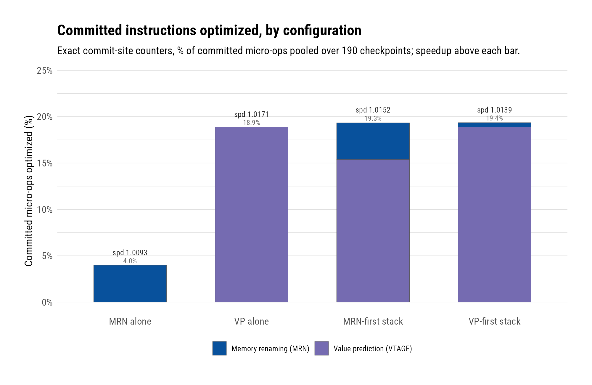
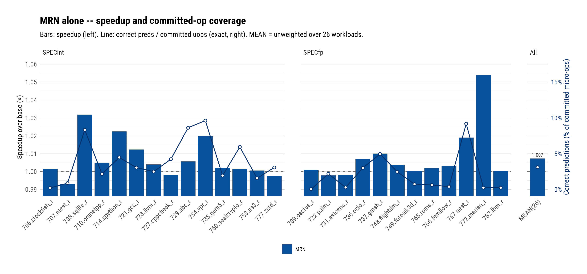

# MRN Is Subsumed: Value Prediction Covers 88% of Memory Renaming's Committed Instructions, and Neither Ladder Order Makes the Stack Faster Than VP Alone

**Date:** 2026-08-05 · **Branch:** `vp` · **Authors:** Rahul Bera and Claude (Fable 5)

---

## 1. Key Idea

Garfield now owns two mechanisms that write a load's (or any
instruction's) result at rename and let dependents proceed
speculatively: **MRN**, the memory-rename predictor whose chapter
closed at geomean 1.0092 (finalized config: threshold 14, gates off;
see the MRN log), and the **value-prediction chapter** that first
matched it (LVP, 1.0093), then doubled it (VTAGE), then bettered that
(E-VTAGE, 1.0238). The obvious question — are they *additive*? — is
usually answered with an IPC bar. That answer is unsatisfying,
because IPC composition confounds three things: how many
instructions each technique actually serves, how much the two
populations overlap, and what the coverage placement does to
scheduling.

This report answers it with accounting instead. Two commit-site
counters (`committedVpPredicted`, `committedMrned`) count, exactly
and disjointly, the committed instructions each technique optimized:
a wrong resolution of either mechanism squashes its instruction
inclusively before it can commit, so *committed implies correct*;
and the rename-stage consumption ladder consults the two mechanisms
in strict priority order, so no instruction is ever claimed by both
and the sum is the union. We measure the composition in **both
ladder orders** — MRN-first (the default) and VP-first (a new
`vpBeforeMrn` flip, motivated mid-campaign by the first order's
result) — against VP alone and MRN alone, on the same 190 SPEC26
checkpoints as every report in this log.

The verdict is subsumption, and it is symmetric: **88.2% of the
committed instructions MRN claims are instructions the value
predictor would have covered anyway.** Both stack orders optimize
*more* committed instructions than VP alone (19.35% and 19.36% of
committed micro-ops vs 18.88%) and both are *slower* (1.0152 and
1.0139 vs 1.0171). MRN's uniquely-coverable residual — the loads VP
cannot confidently predict — is 0.49% of the committed stream and
carries no measurable performance value. The value-prediction
chapter absorbs the memory-renaming chapter.

## 2. Mechanism

No new prediction machinery — this report's mechanism is the
*measurement* and the *ladder control*, both added for it.

### 2.1 The Commit-Site Optimized-Instruction Counters

- `commit.committedVpPredicted` / `commit.committedMrned` — two
  scalars incremented at successful `commitHead`, keyed on the
  instruction's `VpPredicted` / `Mrned` flags.
- **Committed implies correct**: a wrong value prediction or memory
  rename triggers an inclusive squash from the verify site; the
  victim never reaches commit. A committed flagged instruction
  therefore consumed a *correct* speculation.
- **Disjoint by construction**: the rename consumption ladder gives
  one mechanism first claim and offers the other only the unclaimed
  remainder, so the flags are mutually exclusive per instruction and
  the counters' sum is the exact union — "committed instructions
  optimized by either technique."
- The counter commit's gate run proved the addition inert
  (stats value-identical modulo the two new lines) and measured the
  verify-site count's wrong-path overcount (+3.0% for VTAGE
  all-insts) that motivated counting at commit in the first place.

### 2.2 The Ladder and Its Flip

Default order is MRN → VP → execute: MRN's value-forward consumption
runs first and VP's `predict()` is gated on `!isMrned()`. The new
`vpBeforeMrn` parameter (CLI `--vp-before-mrn`) restructures the two
consumption blocks around a shared consume helper: VP claims first
and MRN's value-forward is gated on `!vpPredicted()`. One structural
constraint: MRN's producer-alias path diverts the destination map
*before* renaming, where no VP decision exists yet — the config layer
rejects the flip combined with `--mrn-alias`. (Academic here: the
finalized MRN config has alias off.) The default order was proven
value-identical to the pre-change binary on the gate checkpoint.

### 2.3 Files Touched

- `src/cpu/o3/commit.{hh,cc}` — the two counters.
- `src/cpu/o3/rename.{hh,cc}`, `src/cpu/o3/BaseO3CPU.py` — the
  ladder restructure + `vpBeforeMrn`.
- `configs/garfield/arm/sim_opts.py` — `--vp-before-mrn` and the
  alias incompatibility check.

### 2.4 Commits Covered

- `42c2800c68` — commit-site optimized-instruction counters.
- `53209dac55` — the VP-first ladder flip.

## 3. Evaluation Methodology

- **Simulator/platform/workloads:** as the chapter's other reports —
  Neoverse V2 O3 model, 190 SPEC26 checkpoints (115 SPECint / 75
  SPECfp), 10M warmup + 50M detailed, first-dump ROI, speedups vs
  the shared `base` runs by geomean.
- **Configurations:**
  - `vtage_all_cc` — VP alone: plain VTAGE all-insts (HPCA'14
    series), the VP vehicle these experiments were defined on. (The
    composition question is about *population overlap*, not peak VP;
    a stronger VP — dense-64 or E-VTAGE — only widens the
    subsumption, since it covers more of MRN's population.)
  - `mrn_vtage_all_cc` — the default MRN-first stack; MRN at its
    finalized config (threshold 14, gates off).
  - `vpfirst_mrn_vtage_cc` — the same stack under `--vp-before-mrn`.
  - `mrn_cc` — MRN alone at the finalized config, rerun under the
    counters for its exact committed coverage and a same-binary
    speedup reference (landed: 190/190; reproduces the MRN
    chapter's geomean).
  - IPC sanity: `vtage_all_cc` reproduced the original `vtage_all`
    IPC on the gate checkpoint (the counters are inert), and the
    original arm's 1.0171 geomean is reproduced by the counter arm.
- **Metrics:** *committed-optimized fraction* =
  `(committedVpPredicted + committedMrned) / commitStats0.numOps`
  (share of all committed micro-ops that consumed a correct
  speculation; also quoted per `numInsts` where noted), pooled over
  the 190 checkpoints; per-technique splits are the individual
  counters. Speedup as everywhere in this log. Overlap = the drop in
  VP's committed count when MRN front-runs it, as a fraction of
  MRN's take.

## 4. Key Results

*(figure: `figs/mrn_composition.{png,pdf}`, numbers in
`figs/mrn_composition_numbers.csv`; per-checkpoint data in
`figs/committed_optimized.csv` and `figs/ladder_flip_threeway.csv`)*
*Stacked bars: exact committed micro-ops optimized by MRN (blue) and
VP (purple); geomean speedup above each bar.*

1. **Both stack orders optimize more committed instructions than VP
   alone, and both are slower — coverage and performance invert.**
   VP alone: 18.88% of committed µops at geomean 1.0171. MRN-first
   stack: 19.35% at 1.0152. VP-first stack: 19.36% — the highest
   coverage of the campaign — at 1.0139, the lowest speedup. Adding
   MRN to a VTAGE-class VP buys +0.47pp of covered instructions and
   costs 0.2–0.3% of performance, in whichever order the ladder
   consults them.

2. **The overlap is 88.2%: MRN's population is almost entirely a
   subset of VP's.** With first claim, MRN takes 424.4M committed
   loads (3.95% of committed µops) — and VP's own committed count
   drops by 374.2M on the same runs (1,653.5M vs 2,027.7M alone).
   Only ~50M committed instructions per 10.72B (0.47pp) are
   uniquely MRN's: loads whose value VP cannot confidently predict
   but whose producing store MRN can name. Flipped, the same
   residual measures 52.9M (0.49pp) — the two orders agree on the
   size of MRN's unique territory.

*(figure: `figs/mrn_workload_speedup_covcommit.{png,pdf}`, numbers in
`figs/mrn_workload_speedup_covcommit_numbers.csv`; workload rollup in
`figs/mrn_workload_rollup.csv`)*
*Bars: MRN-alone speedup vs base (left axis). Line: correctly renamed
loads as a share of committed micro-ops, exact (right axis).*

3. **MRN alone optimizes 3.97% of committed micro-ops (4.48% of
   architectural instructions) at geomean 1.0093 — one fifth the
   committed footprint of the VTAGE-class VP (18.88%) and one
   quarter of E-VTAGE's (17.98% at 1.0238).** The standalone rerun
   under the counters doubles as two validations: the speedup
   reproduces the MRN chapter's finalized 1.0092 on the current
   binary, and the standalone take (426.4M committed loads) matches
   the take measured inside the MRN-first stack (424.4M) — the
   ladder barely perturbs MRN's claim, which is what makes the
   overlap subtraction in result 2 sound. Per workload
   (SimPoint-weighted mean 3.1%, workload-level speedup 1.0073),
   coverage concentrates where the chapter's VP coverage also
   concentrates — 708.sqlite_r (7.9%), 767.nest_r (9.3%),
   734.vpr_r (9.4%) — a visual preview of the overlap that result 2
   quantifies.

4. **The VP-first flip does exactly what it was designed to do —
   and still loses, which is the strongest form of the verdict.**
   The flip restores VP's take to its alone-level (2,026.5M vs
   2,027.7M; the 374M contested loads all return to VP) and shrinks
   MRN to its 52.9M unique residual. If MRN's residual had value,
   this configuration would win; instead it is the slowest
   (1.0139). The deficit is tail-driven: `734.vpr_r.0.4` collapses
   to 0.695 vs VP alone while `708.sqlite_r.2.1` gains 1.118 — the
   same coverage-placement chaos in both directions, with the
   geomean landing below both alternatives.

5. **The vpr_r.0.4 collapse is the chapter's cleanest
   scheduling-side-effect specimen: −30% with every accuracy metric
   unchanged.** Across the three arms its VP wrongs are 3.2k/3.4k/
   3.7k, MRN mispredicts 4.8k/4.0k, memory-order violations
   5.8k/5.6k, and the optimized-instruction volume is essentially
   constant (11.3M) — yet IPC falls from 1.56 to 1.08 purely from
   *which mechanism covers the contested loads and when their
   dependents wake*. No confidence, accuracy, or coverage metric
   predicts this; it is a criticality/scheduling phenomenon, and it
   caps what any coverage-maximizing composition can achieve.

6. **Chapter verdict: the MRN chapter stays closed, now with a
   mechanism-level explanation.** MRN was Garfield's first
   demonstration that rename-time result delivery pays (1.0092). The
   VP chapter generalized the delivery mechanism from
   store-to-load communication to arbitrary value production — and
   this report shows the generalization is a superset in the
   measured population sense, not merely in geomean. One general
   mechanism, tuned per class (E-VTAGE), beats any composition of
   the specialized and general forms measured here. For the
   Garfield design, the working conclusion is to carry a single
   value-prediction structure forward and spend the MRN storage
   budget there.

## 5. Next Steps

1. **EVES Stage 2 (E-Stride)** — the remaining EVES component; also
   the principled home for stride-predictable loads, part of MRN's
   unique residual.
2. **The scheduling-side-effect class** — result 5 is the sharpest
   specimen yet; a criticality-aware study of *which* covered
   instructions help vs hurt is the chapter's open frontier and the
   bridge to Garfield's ghost-execution thesis.
3. **E-VTAGE-based composition spot-check** — the subsumption
   argument predicts a stronger VP overlaps MRN even more; a
   16-checkpoint probe of MRN+E-VTAGE would close the loop cheaply
   if the design question ever reopens.
4. **Merge `vp` → `rbdev`** — the chapter's reports are now
   complete through composition; one final whole-branch review
   covering the E-VTAGE-era commits precedes the merge.

## References

[1] G. S. Tyson and T. M. Austin, "Improving the Accuracy and
Performance of Memory Communication Through Renaming," MICRO-30,
1997.

[2] A. Perais and A. Seznec, "Practical Data Value Speculation for
Future High-end Processors," HPCA-20, 2014.

[3] A. Seznec, "Exploring value prediction with the EVES predictor,"
First Championship Value Prediction (CVP-1), 2018.
