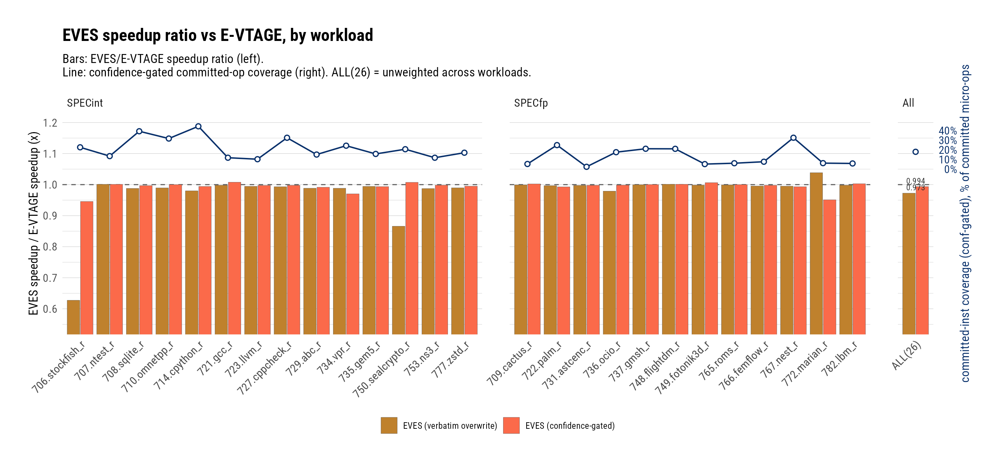
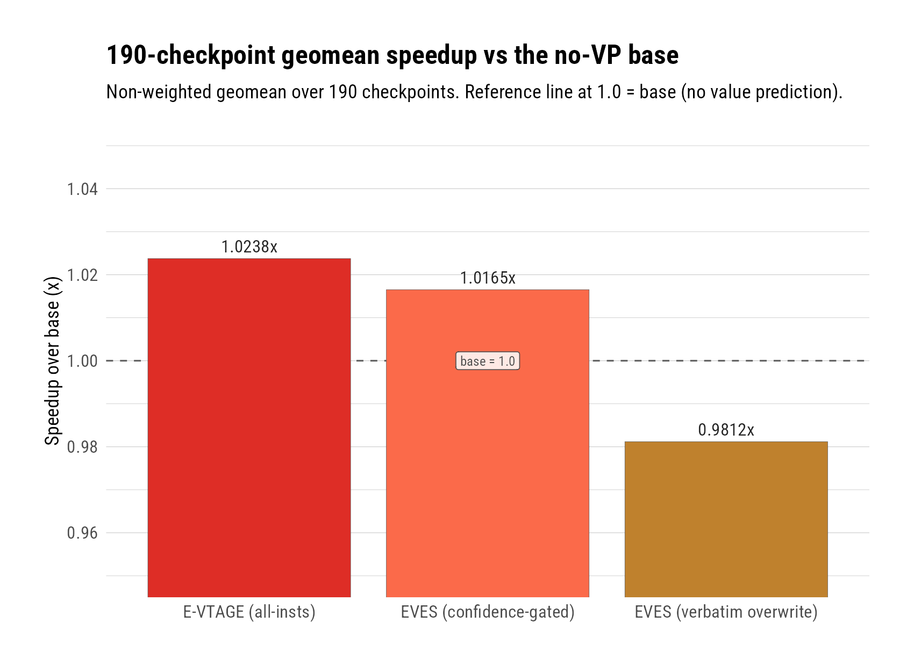

# EVES Assembled: E-Stride Adds Committed Coverage but Not Speedup on a Real Out-of-Order Core

**Date:** 2026-08-15 · **Branch:** `vp` · **Authors:** Rahul Bera and Claude (Fable 5)

---

## 1. Key Idea

The EVES value predictor (Seznec, CVP-1 2018 [1]) combines two
components: E-VTAGE, a history-indexed predictor for repeating values,
and E-Stride, a 48-entry stride predictor that computes
`LastCommittedValue + (inflight + 1) × stride` — the in-flight
occurrence count lets it predict a load whose previous instances are
still speculative, exactly the tight-loop case a classic stride
predictor must sit out. In the CVP-1 framework E-Stride is the
dominant partner: 16.1% speedup alone, most of EVES's 25.3%, from a
0.64KB structure, and the paper reports strong complementarity with
E-VTAGE (41 vs 40 traces improving >10%, only 19 shared). Having
shipped E-VTAGE as Stage 1 (`evtage_all`, geomean 1.0238 over 190
SPEC CPU 2026 checkpoints [4]), the obvious Stage 2 question was
whether composing in E-Stride moves the chapter best.

It does not. On a Neoverse-V2-class out-of-order core with a real
branch predictor, wrong-path execution, and inclusive value-mispredict
squashes, the full EVES composition **loses** to E-VTAGE alone in both
arbitration modes we evaluated: 0.9812 vs base with the
source-verbatim arbitration (−4.2% against `evtage_all`) and 1.0165
with a confidence-gated variant (−0.7%). The mechanism split is the
interesting part: the verbatim mode's loss is dominated by a CVP
source quirk our port widens (a VTAGE tag hit overwrites the stride
value *without a confidence check*), while the confidence-gated mode
shows the purer result — E-Stride's machinery works exactly as
designed, adds +2.6 points of committed-instruction coverage at 99.2%
accuracy, and still loses IPC, because at ~70 flushed instructions per
wrong, its marginal 2.35M wrong predictions cost more than its 282.5M
correct ones save. Coverage is not speedup; this chapter keeps
relearning that lesson from new directions.

This report covers the E-Stride port (verbatim, GTest-pinned), the
framework's new exact in-flight occurrence counter, the EVES
composition and its arbitration ablation, microbench mechanism proofs,
and the 190-checkpoint verdict. `evtage_all` remains the canonical
chapter best.

## 2. Mechanism

We transcribed E-Stride from the CVP-1 contest source
(`cvp8KB/mypredictor.{cc,h}` [2]) — not from the paper, whose prose a
4-agent verification pass found wrong in places (documented in the
design spec [3]) — into a params-free core, and composed it with the
existing E-VTAGE tables inside a new `EvesVP` SimObject
(`--use-vp eves`). Deliberate quirks of the source are implemented as
written and pinned by tests; every deviation is declared in the spec's
§12.

### 2.1 Data Structures

- **`EStrideTable`** — 48 entries, 3-way skewed-associative (16
  sets/way, ways interleaved mod 3 in one flat array), zero-initialized
  with **no valid bit** (a tag-0 hash hits a virgin entry, as in the
  source's static array). Entry: `{lastValue (64b, last committed
  value), stride (full-width; the 20-bit budget is enforced only by
  the training range window), conf (5b, predict at ≥7 of 31), u (2b),
  tag (14b), notFirstOcc (1b)}`. Plus one global `SafeStride` int:
  +1 per in-scope committed instruction (capped 32767, pre-checked —
  legal overshoot to 32774), +4/+8 per correct stride-flagged
  delivery, −1024 per wrong one with no lower clamp; predictions
  blocked while negative. Storage 5104 bits ≈ 0.64KB.
- **In-flight occurrence map** (framework, `BaseValuePredictor`) — an
  exact per-PC counter replacing CVP's 256-deep ring scan: increment
  once per renamed in-scope instruction (after the rename consumption
  ladder, so an instruction never counts itself), decrement exactly
  once at commit-train or on a squash walk, enforced by a new
  `VpInflightCounted` DynInst flag and an underflow panic. Inert for
  every other predictor (bit-identity gated).
- **Token flag bits** — the composed prediction's provider token
  carries the E-VTAGE token in its low bits plus three flags at bits
  63/62/61: `stridePredicted` and `vtageConfident` (CVP's two update
  flags) and `deliveredByVtage` (gem5-only routing for the verify-site
  punish, which CVP does not need).

### 2.2 Predict And Arbitration Algorithm

1. Stride lookup (gates in source order: tag hit → SafeStride ≥ 0 →
   conf ≥ 7) computes the extrapolated value from the framework's
   in-flight count.
2. E-VTAGE lookup runs second, as in the source's `getPrediction`.
3. Arbitration (a pure, GTest-covered helper): the VTAGE value
   **overwrites** the stride value whenever VTAGE tag-hits outside the
   post-misprediction blackout — *without a confidence check* in the
   default source-verbatim mode. Delivery requires a component flag
   (`stridePredicted || vtageConfident`), so a stride-confident
   instruction can deliver a low-confidence VTAGE value: the source's
   own mechanism (its comment "when both are high confidence pick the
   VTAGE prediction" describes intent, not code). The
   `vtageOverwriteRequiresConfidence` param (the confidence-gated
   mode) gates the overwrite on VTAGE confidence instead.
4. Port caveat that turned out to matter: in CVP, the overwrite also
   requires the VTAGE entry's value pointer to be *materialized*
   (reached near-saturation confidence at least once, torn down on
   every mismatch). Our E-VTAGE stores full values per entry, so
   "materialized" has no equivalent; the verbatim mode maps it to
   "any tag hit" — **strictly broader than CVP** — while the
   confidence-gated mode is narrower. The two modes bracket CVP's true
   behavior, and for never-confident entries (values that keep
   changing) the confidence-gated mode is the closer approximation.

### 2.3 Training, SafeStride, And Verify Routing

1. At commit, for every in-scope instruction: SafeStride tick and
   (flag-keyed) credit, then E-VTAGE training, then stride training —
   the source's per-instruction order.
2. Stride training: `lastValue` updates unconditionally; a trained
   entry checks the raw one-step identity (`lastValue_old + stride ==
   actual`) — correct occurrences run the probabilistic
   confidence/usefulness draws (per-class exponents; extra draws only
   for *positive* strides ≥ 8/64, the source's abs-of-a-boolean
   quirk); a mismatch decays conf by 4 (collapse at ≤ 4) and restarts
   stride learning; a first occurrence stores the delta or demotes the
   entry with the `0xffff` sentinel (`conf = u = 0`) for zero or
   out-of-range deltas — the paper's "null strides are systematic
   replacement targets".
3. Verify-wrong routing (flag-keyed, source-exact): SafeStride −1024
   iff `stridePredicted` — even when VTAGE supplied the wrong value;
   the E-VTAGE corrective punish fires only when `deliveredByVtage`;
   the stride table gets no verify-site punish at all (SafeStride is
   its no-livelock mechanism).

Declared deviations (full list in the spec §12): exact in-flight
counter instead of the ring scan; SafeStride tick/credit at the commit
site; the overflow-free range window `delta ∈ [−2^19+1, +2^19]`; the
materialized→any-tag-hit mapping above; probability-equivalent rather
than bitstream-identical draws; the (PC, µPC) key fold; default
`burstGuardWindow = 0` (the source's always-on 128-instruction VTAGE
blackout is available as an ablation).

### 2.4 Files Touched

- `src/cpu/o3/vp/estride_table.{hh,cc}` + `estride_table.test.cc` —
  the params-free E-Stride core; 21 GTests pin every rule arm.
- `src/cpu/o3/vp/eves_arbiter.hh` — the pure arbitration helper.
- `src/cpu/o3/vp/eves.{hh,cc}` — the `EvesVP` SimObject: composition,
  token routing, SafeStride call sites, per-supplier statistics.
- `src/cpu/o3/vp/vp_inflight_map.hh` + `vp_inflight_map.test.cc`,
  `src/cpu/o3/vp/base.{hh,cc}`, `src/cpu/o3/dyn_inst.hh`,
  `src/cpu/o3/rename.cc`, `src/cpu/o3/rob.cc`, `src/cpu/o3/cpu.cc` —
  the in-flight counter subsystem and its pipeline hooks
  (`notifyRenamedInst` also feeds the burst-guard rename count).
- `src/cpu/o3/vp/ValuePredictor.py`, `src/cpu/o3/vp/SConscript`,
  `configs/garfield/arm/sim_opts.py` — params and CLI (`--use-vp
  eves`, `--eves-vtage-overwrite-requires-confidence`).
- gem5-infra `workloads/microbenchmarks/src/{vpstride,vpstorm}.c` —
  mechanism-proof benches.

### 2.5 Commits Covered

- `11b3cb543f` — design spec (with E-VTAGE spec erratum)
- `9521fa7367` — implementation plan
- `92a65e8e50` — in-flight occurrence counters
- `dba1b511bf` — E-VTAGE burst-guard comment refresh
- `10501c4560` — E-Stride core + arbiter + GTests
- `d07c81fe64` — victim-arm test pins; classifier docs
- `8e40e8c31f` — the EVES SimObject + config plumbing
- `1b09c90c02`, `8b79972f4b` — residual-analysis corrections
- gem5-infra `b8da7b4`, `499957e` — vpstride/vpstorm benches

## 3. Evaluation Methodology

- Simulator: this fork's Neoverse-V2-like O3 configuration (8-wide,
  256-entry ROB, 2MiB LLC), FS restore from SimPoint checkpoints; 10M
  instructions warmup + 50M detailed per checkpoint.
- Workloads: the standing 190 SPEC CPU 2026 checkpoint set (43
  workloads); suite classification per SPEC's index [5].
- Arms (all VTAGE sides at the canonical dense-64 history series
  `{2,4,6,11,20,36,64}`, all-instructions scope): `evtage_all` (the
  Stage-1 chapter best, control), `eves_all` (verbatim overwrite),
  `eves_all_confgate` (`--eves-vtage-overwrite-requires-confidence`).
  The loads-only EVES arm was probe-negative (0.9827 vs `evtage`) and
  was not promoted to 190.
- Speedups: per-checkpoint ROI IPC ratios, geomean over 190. The
  16-checkpoint probe preceded promotion; note it contains no
  stockfish checkpoint, which made its verbatim-mode reading (0.9985)
  far too kind — see result 3.
- Committed coverage = `commit.committedVpPredicted /
  commitStats0.numOps` (exact, commit-site; the control's counters
  come from the `evtage_all_cc` rerun).
- Supply split uses only the commit/verify-site counters
  (`deliveredCorrectBy*` / `deliveredWrongBy*`); the speculative-site
  `suppliedBy*` pair counts wrong-path lookups. `predictionsCorrect`
  exceeds the delivered-correct sum by the verified-correct predictions
  squashed or faulted before commit — an identity correction this
  campaign documented while validating the counters.

## 4. Key Results

*(figure: `figs/eves_workload_ratio_covcommit.{png,pdf}`, numbers in
`figs/eves_workload_ratio_covcommit_numbers.csv`)*
*Bars: per-workload speedup ratio of each EVES mode over `evtage_all`
(1.0 = parity); line: the confidence-gated arm's committed coverage.*
*The All-facet ratios (0.973/0.994) are per-workload rollups
(SimPoint-weighted within inv, equal across invs and workloads); the
text's headline ratios (0.9584/0.9929) are per-checkpoint geomeans —
the rollup dilutes the 12-checkpoint stockfish family to one workload.*

*(figure: `figs/eves_geomean_ladder.{png,pdf}`, numbers in
`figs/eves_geomean_ladder_numbers.csv`)*
*The three 190-checkpoint geomeans against the no-VP base.*

1. **The EVES composition does not beat E-VTAGE alone: 190-checkpoint
   geomeans are 1.0238 (`evtage_all`), 1.0165 (EVES
   confidence-gated), 0.9812 (EVES verbatim).** Against the control
   that is 0.9929 and 0.9584 respectively; the confidence-gated mode
   wins on only 64/190 checkpoints (11 above +1%, 33 below −1%).
   `evtage_all` remains the canonical chapter configuration. The
   result is robust to outlier removal: excluding the entire stockfish
   family (result 3) still leaves both modes negative (0.9968 and
   0.9902 vs control).

2. **E-Stride's machinery works exactly as designed and still loses:
   the confidence-gated arm adds +2.64 points of committed coverage
   (17.95% → 20.59% of µops) at 99.18% stride accuracy — and gives
   back 0.7% IPC.** The stride side delivers 282.5M committed-correct
   predictions against 2.35M verified-wrong ones; with inclusive
   value-mispredict squashes costing ~70 instructions each (the
   chapter's standing flush cost), the wrongs' flush bill exceeds the
   corrects' latency savings. This is the chapter's recurring
   coverage-is-not-speedup lesson in its sharpest form yet: a
   mechanism with *better* accuracy than LVP ever had (99.2% vs
   99.4-99.6% at far lower reward density) still nets negative because
   its correct predictions mostly shave latency the out-of-order core
   already hides, while its wrongs always pay full price.

3. **The verbatim-overwrite mode is dominated by a port-widened source
   quirk, with the stockfish family as the catastrophe case: all 12
   stockfish checkpoints land between 0.45 and 0.51 of the control
   (family geomean 0.5904).** In the source, a VTAGE tag hit
   overwrites the stride value without any confidence check; our port
   widens the accompanying materialization gate to "any tag hit"
   (§2.2). The result: 7.97M low-confidence overwrites of confident
   stride predictions, and 4.34M wrong deliveries attributed to the
   VTAGE side — 6.7× the control's total wrong count (649k). On
   stockfish checkpoints the per-checkpoint pattern is ~40k
   VTAGE-supplied wrongs vs the control's ~3-4k. SPECint carries
   almost all of the damage (0.9340 suite geomean vs SPECfp's
   0.9970). The 16-checkpoint probe, which contains no stockfish,
   read this mode at 0.9985 — a caution entry for the probe
   methodology: the probe set's suite balance can hide a
   family-concentrated failure mode.

4. **The arbitration A/B answers the question it was built for:
   confidence-gating the overwrite is worth +3.6% (ratio 1.0360 over
   the verbatim mode), and the microbenches predicted it.** On
   `vpstride` (one load PC, strided values, cache-defeating
   addresses), the verbatim mode locks E-Stride out completely — all
   3,013 stride predictions are overwritten by a never-confident
   VTAGE value, E-VTAGE is wrong on 100% of what it verifies, and the
   flag-keyed SafeStride penalties (fired for wrongs the stride side
   never supplied) hold the predict gate shut for 99.4% of hits.
   Confidence-gated, the same bench runs at 89.4% coverage with a
   233.5:1 correct:wrong ratio and the in-flight extrapolation
   demonstrably working (in-flight depth at prediction: mean 25.2,
   96.4% of samples ≥ 20). `--use-vp evtage` on the same bench makes
   exactly 0 predictions — the complementarity is real; it just does
   not pay at SPEC scale.

5. **CVP's headline does not transfer: the framework, not the
   predictor, made E-Stride dominant.** E-Stride carries most of
   EVES's 25.3% in CVP-1 [1]; here its incremental contribution is
   negative in both modes. The deltas are structural: CVP has a
   perfect branch predictor, no wrong-path execution, idealized
   16-wide fetch, and a value mispredict that stalls but never
   pollutes; our core pays inclusive squashes, wrong-path table
   pollution, and scheduling side effects. E-Stride's profile —
   low coverage, high per-prediction reward on LLC-missing loads —
   is precisely the profile most sensitive to real squash costs,
   because its target loads sit at the head of long dependence chains
   where a wrong prediction restarts the most work.

6. **Real winners exist and are the complementarity the paper
   promised, in miniature: marian_r.1.4 +8.8%, sealcrypto_r.0.1
   +2.7%, sqlite_r.2.1 +2.5%, vpr_r.2.3 +2.1% (confidence-gated, vs
   control).** These are strided-value workloads E-VTAGE cannot see.
   But the winner set is narrow — 11 checkpoints above +1% — and it
   cannot pay for the broad shallow-loss tail (33 below −1%).

7. **The scheduling-side-effect specimen class claims this chapter's
   losers too: vpr_r.0.4 is the confidence-gated mode's worst
   checkpoint (0.8142) with unremarkable accuracy, and the marian
   family splits (r.1.4 +8.8%, r.0.2 −10.8%).** The same checkpoints
   flagged in the VTAGE and MRN-composition reports [4] flip on
   issue-timing perturbations rather than prediction quality —
   reinforcing that per-checkpoint tails in this regime measure
   scheduling sensitivity, not predictor merit.

8. **The framework's new exact in-flight counter closes perfectly
   under hostile conditions.** The `vpstorm` bench (49.9% branch
   mispredicts by design) drives 634k squash-side decrements with the
   closure identity `increments == decTrain + decSquash` exact at the
   drained exit (a documented −15 residual from the bench's ROI-reset,
   with the sign the mechanism predicts), and no underflow panic. The
   counter replaces CVP's ring scan, whose stale-slot and wrap hazards
   the verification pass documented.

9. **Words of caution for reuse of these numbers.** (a) The
   committed-coverage figures use the exact commit-site counters;
   verify-site coverage runs ~3-5% higher (wrong-path corrects). (b)
   `predictionsCorrect` legitimately exceeds the per-supplier
   delivered-correct sum by the verified-correct-then-squashed term —
   do not treat the gap as a bug or "fix" it in analysis scripts. (c)
   The verbatim mode's numbers measure our port's widened overwrite
   predicate, not CVP's own materialization-gated behavior; CVP's true
   arbitration lies between the two arms, near the confidence-gated
   one for never-confident entries.

## 5. Next Steps

1. **Decide the shipping default for `EvesVP`'s arbitration** — the
   confidence-gated mode is unambiguously the better of the two
   (+3.6%), so if EVES stays available as a config, flipping
   `vtageOverwriteRequiresConfidence` to True (with a spec §5/§12
   amendment) is the defensible default; ranked first because it is a
   one-line decision that changes what every future EVES experiment
   measures. *Resolved 2026-08-15: the default is now
   confidence-gated; the verbatim overwrite is the opt-in
   `--eves-vtage-overwrite-verbatim` ablation.*
2. **Criticality-gated stride prediction** — result 2 says E-Stride's
   corrects mostly shave hidden latency while its wrongs pay full
   price; gating stride deliveries on load criticality (or a
   cost-benefit confidence threshold well above 7) is the one lever
   that attacks the actual loss mechanism, and it feeds the chapter's
   larger criticality thread.
3. **Stockfish forensics** — result 3's family-concentrated collapse
   under the verbatim mode is fully explained, but the confidence-gated
   mode also loses ~6% there; understanding whether that is stride
   wrongs on chess-board scans or scheduling would sharpen the
   negative result.
4. **Probe-set suite balance** — add one stockfish checkpoint to the
   standing 16-checkpoint probe so family-concentrated failures
   surface before a 190 promotion.

## References

[1] A. Seznec, "Exploring value prediction with the EVES predictor,"
First Championship Value Prediction (CVP-1), Los Angeles, June 2018.
HAL hal-01888864. Local copy: `docs/research-papers/eves.pdf`.

[2] CVP-1 contest source, `Seznec.tar.gz` (cvp8KB configuration),
microarch.org/cvp1 — the authoritative reference this port transcribes.

[3] `docs/superpowers/specs/2026-08-14-estride-design.md` — the design
spec: fidelity doctrine, ratified forks, declared deviations.

[4] `docs/research-log/VP/2026-08-05-evtage.md` and
`2026-08-05-mrn-vp-composition.md` — Stage 1 (E-VTAGE) results and the
MRN composition verdict this report's baselines come from.

[5] SPEC CPU 2026 benchmark index,
https://www.spec.org/cpu2026/docs/index.html#benchmarks.
